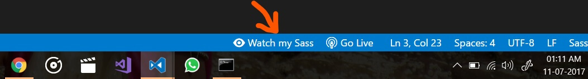
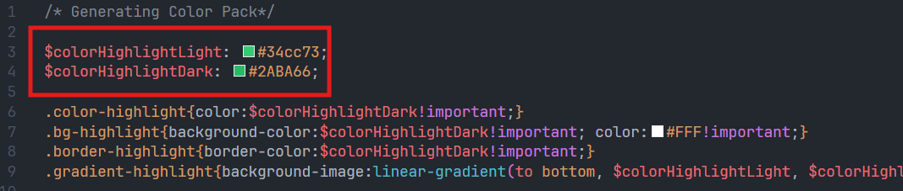

# سوالات متداول

لطفاً توجه کنید که تمام کدهای جاوا اسکریپت در این قالب به گونه ای نوشته شده است که تا حد امکان کوتاه، سریع، آسان برای استفاده باشد.

## سوالات رایج

❓ [آیا میتوانم از Angular, React, Vue یا فریمورک های دیگر استفاده کنم؟](/appkit/faq#%D8%A2%DB%8C%D8%A7-%D9%85%DB%8C%D8%AA%D9%88%D8%A7%D9%86%D9%85-%D8%A7%D8%B2-angular-react-vue-%DB%8C%D8%A7-%D9%81%D8%B1%DB%8C%D9%85%D9%88%D8%B1%DA%A9-%D9%87%D8%A7%DB%8C-%D8%AF%DB%8C%DA%AF%D8%B1-%D8%A7%D8%B3%D8%AA%D9%81%D8%A7%D8%AF%D9%87-%DA%A9%D9%86%D9%85)\
❓ [وقتی سعی میکنم به یک لینک خارجی بروم، صفحه رفرش میشود. چرا؟](/appkit/faq#%D9%88%D9%82%D8%AA%DB%8C-%D8%B3%D8%B9%DB%8C-%D9%85%DB%8C%DA%A9%D9%86%D9%85-%D8%A8%D9%87-%DB%8C%DA%A9-%D9%84%DB%8C%D9%86%DA%A9-%D8%AE%D8%A7%D8%B1%D8%AC%DB%8C-%D8%A8%D8%B1%D9%88%D9%85-%D8%B5%D9%81%D8%AD%D9%87-%D8%B1%D9%81%D8%B1%D8%B4-%D9%85%DB%8C%D8%B4%D9%88%D8%AF-%DA%86%D8%B1%D8%A7)\
❓ [کد جاوا اسکریپت من فقط در صورتی کار میکند که صفحه را رفرش کنم](/appkit/faq#%DA%A9%D8%AF-%D8%AC%D8%A7%D9%88%D8%A7-%D8%A7%D8%B3%DA%A9%D8%B1%DB%8C%D9%BE%D8%AA-%D9%85%D9%86-%D9%81%D9%82%D8%B7-%D8%AF%D8%B1-%D8%B5%D9%88%D8%B1%D8%AA%DB%8C-%DA%A9%D8%A7%D8%B1-%D9%85%DB%8C%DA%A9%D9%86%D8%AF-%DA%A9%D9%87-%D8%B5%D9%81%D8%AD%D9%87-%D8%B1%D8%A7-%D8%B1%D9%81%D8%B1%D8%B4-%DA%A9%D9%86%D9%85)\
❓ [چگونه جی کوئری را پیاده سازی کنم؟ من به آن نیاز دارم](/appkit/faq#%DA%86%DA%AF%D9%88%D9%86%D9%87-%D8%AC%DB%8C-%DA%A9%D9%88%D8%A6%D8%B1%DB%8C-%D8%B1%D8%A7-%D9%BE%DB%8C%D8%A7%D8%AF%D9%87-%D8%B3%D8%A7%D8%B2%DB%8C-%DA%A9%D9%86%D9%85-%D9%85%D9%86-%D8%A8%D9%87-%D8%A2%D9%86-%D9%86%DB%8C%D8%A7%D8%B2-%D8%AF%D8%A7%D8%B1%D9%85)\
❓ [پوشه plugins چه کاربردی دارد؟](/appkit/faq#%D9%BE%D9%88%D8%B4%D9%87-plugins-%DA%86%D9%87-%DA%A9%D8%A7%D8%B1%D8%A8%D8%B1%D8%AF%DB%8C-%D8%AF%D8%A7%D8%B1%D8%AF)\
❓ [متغیرهای isAJAX - isPWA - pwaName در custom.js چیست؟](/appkit/faq#%D9%85%D8%AA%D8%BA%DB%8C%D8%B1%D9%87%D8%A7%DB%8C-isajax---ispwa---pwaname-%D8%AF%D8%B1-customjs-%DA%86%DB%8C%D8%B3%D8%AA)\
❓ [وب اپلیکیشن نصب نمیشود، جعبه نصب PWA ظاهر نمیشوند، چرا؟](/appkit/faq#%D9%88%D8%A8-%D8%A7%D9%BE%D9%84%DB%8C%DA%A9%DB%8C%D8%B4%D9%86-%D9%86%D8%B5%D8%A8-%D9%86%D9%85%DB%8C%D8%B4%D9%88%D8%AF-%D8%AC%D8%B9%D8%A8%D9%87-%D9%86%D8%B5%D8%A8-pwa-%D8%B8%D8%A7%D9%87%D8%B1-%D9%86%D9%85%DB%8C%D8%B4%D9%88%D9%86%D8%AF-%DA%86%D8%B1%D8%A7)\
❓ [منوها سفید یا خالی نشان داده میشوند، چرا؟](/appkit/faq#%D9%85%D9%86%D9%88%D9%87%D8%A7-%D8%B3%D9%81%DB%8C%D8%AF-%DB%8C%D8%A7-%D8%AE%D8%A7%D9%84%DB%8C-%D9%86%D8%B4%D8%A7%D9%86-%D8%AF%D8%A7%D8%AF%D9%87-%D9%85%DB%8C%D8%B4%D9%88%D9%86%D8%AF-%DA%86%D8%B1%D8%A7)

## توضیحات ساختار SCSS

❓ [ایجاد طرح رنگی دلخواه](/appkit/faq#%D8%A7%DB%8C%D8%AC%D8%A7%D8%AF-%D8%B7%D8%B1%D8%AD-%D8%B1%D9%86%DA%AF%DB%8C-%D8%AF%D9%84%D8%AE%D9%88%D8%A7%D9%87)\
❓ [چرا به جای CSS از SCSS استفاده کنیم؟](/appkit/faq#%DA%86%D8%B1%D8%A7-%D8%A8%D9%87-%D8%AC%D8%A7%DB%8C-css-%D8%A7%D8%B2-scss-%D8%A7%D8%B3%D8%AA%D9%81%D8%A7%D8%AF%D9%87-%DA%A9%D9%86%DB%8C%D9%85)\
❓ [من از SCSS خوشم نمیاد. میتونم به جای آن از CSS استفاده کنم؟](/appkit/faq#%D9%85%D9%86-%D8%A7%D8%B2-scss-%D8%AE%D9%88%D8%B4%D9%85-%D9%86%D9%85%DB%8C%D8%A7%D8%AF-%D9%85%DB%8C%D8%AA%D9%88%D9%86%D9%85-%D8%A8%D9%87-%D8%AC%D8%A7%DB%8C-%D8%A2%D9%86-%D8%A7%D8%B2-css-%D8%A7%D8%B3%D8%AA%D9%81%D8%A7%D8%AF%D9%87-%DA%A9%D9%86%D9%85) \
❓ [چگونه میتوانم لوگو یا سایر موارد را بدون SCSS تغییر دهم؟](/appkit/faq#%DA%86%DA%AF%D9%88%D9%86%D9%87-%D9%85%DB%8C%D8%AA%D9%88%D8%A7%D9%86%D9%85-%D9%84%D9%88%DA%AF%D9%88-%DB%8C%D8%A7-%D8%B3%D8%A7%DB%8C%D8%B1-%D9%85%D9%88%D8%A7%D8%B1%D8%AF-%D8%B1%D8%A7-%D8%A8%D8%AF%D9%88%D9%86-scss-%D8%AA%D8%BA%DB%8C%DB%8C%D8%B1-%D8%AF%D9%87%D9%85)\
❓ [حالت تاریک، رنگ‌ها و کوکی‌های پس‌زمینه](/appkit/faq#%D8%AD%D8%A7%D9%84%D8%AA-%D8%AA%D8%A7%D8%B1%DB%8C%DA%A9-%D8%B1%D9%86%DA%AF%D9%87%D8%A7-%D9%88-%DA%A9%D9%88%DA%A9%DB%8C%D9%87%D8%A7%DB%8C-%D9%BE%D8%B3%D8%B2%D9%85%DB%8C%D9%86%D9%87)

## جاوا اسکریپت و AJAX

❓ [چرا ساختار صفحه اینگونه ساخته شده است؟](/appkit/faq#%DA%86%D8%B1%D8%A7-%D8%B3%D8%A7%D8%AE%D8%AA%D8%A7%D8%B1-%D8%B5%D9%81%D8%AD%D9%87-%D8%A7%DB%8C%D9%86%DA%AF%D9%88%D9%86%D9%87-%D8%B3%D8%A7%D8%AE%D8%AA%D9%87-%D8%B4%D8%AF%D9%87-%D8%A7%D8%B3%D8%AA)\
❓ [آیا میتوانم از المان های پیشفرض بوت استرپ استفاده کنم؟](/appkit/faq#%D8%A2%DB%8C%D8%A7-%D9%85%DB%8C%D8%AA%D9%88%D8%A7%D9%86%D9%85-%D8%A7%D8%B2-%D8%A7%D9%84%D9%85%D8%A7%D9%86-%D9%87%D8%A7%DB%8C-%D9%BE%DB%8C%D8%B4%D9%81%D8%B1%D8%B6-%D8%A8%D9%88%D8%AA-%D8%A7%D8%B3%D8%AA%D8%B1%D9%BE-%D8%A7%D8%B3%D8%AA%D9%81%D8%A7%D8%AF%D9%87-%DA%A9%D9%86%D9%85)\
❓ [AJAX چگونه در قالب کار میکند؟](/appkit/faq#ajax-%DA%86%DA%AF%D9%88%D9%86%D9%87-%D8%AF%D8%B1-%D9%82%D8%A7%D9%84%D8%A8-%DA%A9%D8%A7%D8%B1-%D9%85%DB%8C%DA%A9%D9%86%D8%AF)\
❓ [چگونه سیستم AJAX را غیرفعال کنم؟](/appkit/faq#%DA%86%DA%AF%D9%88%D9%86%D9%87-%D8%B3%DB%8C%D8%B3%D8%AA%D9%85-ajax-%D8%B1%D8%A7-%D8%BA%DB%8C%D8%B1%D9%81%D8%B9%D8%A7%D9%84-%DA%A9%D9%86%D9%85)\
❓ [چگونه سیستم PWA را غیرفعال کنم؟](/appkit/faq#%DA%86%DA%AF%D9%88%D9%86%D9%87-%D8%B3%DB%8C%D8%B3%D8%AA%D9%85-pwa-%D8%B1%D8%A7-%D8%BA%DB%8C%D8%B1%D9%81%D8%B9%D8%A7%D9%84-%DA%A9%D9%86%D9%85)\
❓ [چگونه میتوانم عناصر دیگر را به صورت کدنویسی فعال کنم؟](/appkit/faq#%DA%86%DA%AF%D9%88%D9%86%D9%87-%D9%85%DB%8C%D8%AA%D9%88%D8%A7%D9%86%D9%85-%D8%B9%D9%86%D8%A7%D8%B5%D8%B1-%D8%AF%DB%8C%DA%AF%D8%B1-%D8%B1%D8%A7-%D8%A8%D9%87-%D8%B5%D9%88%D8%B1%D8%AA-%DA%A9%D8%AF%D9%86%D9%88%DB%8C%D8%B3%DB%8C-%D9%81%D8%B9%D8%A7%D9%84-%DA%A9%D9%86%D9%85)

## پلاگین های CSS و جاوا اسکریپت

❓ [ایمپورت و فراخوانی به روش قدیمی (پیشنهادی برای مبتدیان)](/appkit/faq#%D8%A7%DB%8C%D9%85%D9%BE%D9%88%D8%B1%D8%AA-%D9%88-%D9%81%D8%B1%D8%A7%D8%AE%D9%88%D8%A7%D9%86%DB%8C-%D8%A8%D9%87-%D8%B1%D9%88%D8%B4-%D9%82%D8%AF%DB%8C%D9%85%DB%8C)\
❓ [ایمپورت و فراخوانی فایل ها بر اساس تقاضا (برای عملکرد بهتر)](/appkit/faq#%D8%A7%DB%8C%D9%85%D9%BE%D9%88%D8%B1%D8%AA-%D9%88-%D9%81%D8%B1%D8%A7%D8%AE%D9%88%D8%A7%D9%86%DB%8C-%D9%81%D8%A7%DB%8C%D9%84-%D9%87%D8%A7-%D8%A8%D8%B1-%D8%A7%D8%B3%D8%A7%D8%B3-%D8%AA%D9%82%D8%A7%D8%B6%D8%A7)

## عملکرد و سرعت صفحه

❓ [صفحه من به اندازه کافی سریع نیست میتونی کمکم کنی؟](/appkit/faq#%D8%B5%D9%81%D8%AD%D9%87-%D9%85%D9%86-%D8%A8%D9%87-%D8%A7%D9%86%D8%AF%D8%A7%D8%B2%D9%87-%DA%A9%D8%A7%D9%81%DB%8C-%D8%B3%D8%B1%DB%8C%D8%B9-%D9%86%DB%8C%D8%B3%D8%AA-%D9%85%DB%8C%D8%AA%D9%88%D9%86%DB%8C-%DA%A9%D9%85%DA%A9%D9%85-%DA%A9%D9%86%DB%8C)\
❓ [از فایل های CSS و JS فشرده و کوچکتر استفاده نمیکنید؟ چرا؟](/appkit/faq#%D8%A7%D8%B2-%D9%81%D8%A7%DB%8C%D9%84-%D9%87%D8%A7%DB%8C-css-%D9%88-js-%D9%81%D8%B4%D8%B1%D8%AF%D9%87-%D9%88-%DA%A9%D9%88%DA%86%DA%A9%D8%AA%D8%B1-%D8%A7%D8%B3%D8%AA%D9%81%D8%A7%D8%AF%D9%87-%D9%86%D9%85%DB%8C%DA%A9%D9%86%DB%8C%D8%AF-%DA%86%D8%B1%D8%A7)

---

## سوالات رایج

### آیا میتوانم از Angular, React, Vue یا فریمورک های دیگر استفاده کنم؟

بله. بسیاری از مشتریان، قالب را بدون مشکل به SPA(Single Page Applications) تبدیل کرده اند. با این حال، برای اینکه با React/Vue/Angular یا هر فریم ورک دیگری تداخل نداشته باشید، **custom.js** را باز کنید و پارامتر `isAJAX` را روی `false` قرار دهید. در [اینجا](#) میتوانید درباره این تنظیمات بیشتر اطلاعات کسب کنید. سیستم AJAX میتواند با نحوه مدیریت DOM های مجازی در فرم ورک های SPA تداخل ایجاد کند. علاوه بر این، این فریم ورک ها به سیستم AJAX نیاز ندارند، زیرا آنها از قبل دارای مدیریت حالت و روترهایی هستند که مشکلات سرعتی را که سیستم AJAX برای آن وجود دارد، مدیریت میکند.\
`isAJAX` را روی `false` تنظیم کنید، و میتوانید قالب را به هر فریم ورکی که میخواهید تبدیل کنید.

### وقتی سعی میکنم به یک لینک خارجی بروم، صفحه رفرش میشود. چرا؟

ما عملکرد تغییر صفحه AJAX را در [این سوال](#) شرح میدهیم. اما، برای خلاصه کردن همه چیز، صفحه سعی میکند لینک های خارجی را در داخل صفحه شناسهdiv بارگیری کند و باعث بارگیری مجدد صفحه شود. برای جلوگیری از این مورد، لینک پیشفرض کلاس را به هر لینکی که به سمت یک صفحه خارجی هدف قرار میدهید، اضافه کنید. لینک شما `href="your-external-link" class="default-link"` خواهد بود.

### کد جاوا اسکریپت من فقط در صورتی کار میکند که صفحه را رفرش کنم

همه پلاگین های جاوا اسکریپت خود را بالای **custom.js** اضافه و تابع فراخوانی خود را در داخل تابع `init_template()` قرار دهید، **نه در فایل های HTML.** حتماً [ایمپورت پلاگین های JS و CSS](#) را نیز بررسی کنید. 2 راه برای فراخوانی آنها وجود دارد، یکی از موارد ذکر شده در اینجا و یکی سیستم بارگذاری modular که برای عملکرد سایت بهتر است.

### چگونه جی کوئری را پیاده سازی کنم؟ من به آن نیاز دارم

jquery.js خود را به پایین صفحه، درست بالای **boostrap.min.js** اضافه کنید. **آن را به همه صفحات اضافه کنید**. بعد از اینکه آن را به پایین صفحه خود اضافه کردید، کدهای فراخوانی jQuery خود را در داخل **custom.js** داخل تابع `init_template()` قرار دهید. اگر میخواهید jQuery را در فایل HTML اضافه کنید، باید با دنبال کردن [این سوال](#)، بارگذاری صفحه AJAX را غیرفعال کنید. استفاده از AJAX برای سرعت صفحه مهم است مگر اینکه صفحات را در Angular یا Vue یا React ایجاد کنید، جایی که روترها میتوانند استفاده شوند. توصیه میشود همه کدهای فراخوانی سفارشی خود را در **custom.js** نگه دارید. اگر میخواهید از jQuery استفاده کنید، از ساختار زیر استفاده کنید.

```html
<script type="text/javascript" src="js/jquery.js"></script>
<script type="text/javascript" src="js/your-jquery-plugins-go-here.js"></script>
<script type="text/javascript" src="js/bootstrap.min.js"></script>
<script type="text/javascript" src="js/custom.js"></script>
```

### پوشه plugins چه کاربردی دارد؟

پوشه plugins پلاگین هایی را که ما از طریق لودر modular خود استفاده میکنیم را نگه می دارد. این سیستم باعث میشود که صفحه بسیار سریعتر از حالت عادی بارگذاری شود، بدون اینکه کارایی کاهش یابد. برای اطلاعات بیشتر [این بخش](#) را بررسی کنید

### متغیرهای isAJAX - isPWA - pwaName در custom.js چیست؟

این متغییرها مقادیر **boolean** هستند که میتوانند برای اصلاح عملکرد برخی از جنبه های قالب استفاده شوند. بیایید آنها را توضیح دهیم:

- `var isPWA = true`\
  این متغیر، قالب را از حالت pwa بودن غیرفعال یا فعال میکند، به این معنی که اگر این متغیر روی `false` تنظیم شود، **service-worker** بارگذاری نمیشود، بنابراین صفحه به یک قالب HTML کلاسیک تبدیل میشود.

- `var isAJAX = true`\
  صفحات قالب از انتقال صفحه و سیستم AJAX که به طور کامل در [این سوال](#) توضیح داده شده است، استفاده میکند. در صورتی که میخواهید از منطق روتر خود استفاده کنید، یا React، Angular، Vue را پیاده‌سازی کنید و اسکریپت‌های شما بارگیری نمیشوند، میتوانید این متغیر را روی `false` تنظیم کنید. اگر قصد دارید یک فرم ورک SPA خارجی مانند React یا Vue پیاده‌سازی کنید، که در آن سیستم AJAX نسبت به سیستم‌های ارائه شده توسط این فرم ورک ها قدرت کمتری دارد، این کار اکیداً توصیه میشود. در غیر این صورت، سیستم `isAJAX` نباید حذف شود زیرا باعث افزایش سرعت قالب میشود.

- `var pwaName = 'Appkit'`\
  **pwaName** متغیر اصلی است که برای ثبت سرویس ورکر و همچنین ایجاد تمام متغیرهای `localStorage` لازم برای به خاطر سپردن حالت تاریک، رنگ هایلایت انتخابی و همچنین نصب یا عدم نصب وب اپلیکیشن در صفحه اصلی استفاده میشود. شما باید نام سایت یا کسب و کار خود را در اینجا ثبت کنید تا از مشکلات مربوط به متغیرهای متناقض در بررسی مقادیر `localStorage` جلوگیری شود.

- `var remind = 1'`\
  اگر کادرهای نصب وب اپلیکیشن را به صفحه اصلی اپ خود اضافه کرده‌اید کاربر را به نصب برنامه ترغیب میکند، این کادرها دو گزینه دارند، **نصب** یا **شاید بعدا**. وقتی کاربر روی **شاید بعدا** کلیک کند، مقدار اینجا نشان میدهد که اگر کاربر دوباره به صفحه مراجعه کند، چند روز قبل از نمایش مجدد پنجره، پیام نمایش داده خواهد شد. در مثال ما، اگر کاربر نصب برنامه را رد کند، پنجره پیام نصب pwa به مدت 24 ساعت دیگر ظاهر نمیشود.

- `var pwaNoCache = false`\
  این متغیر تضمین میکند که PWA شما همیشه داده های تازه را دریافت میکند. هر زمان که PWA خود را پس از بستن کامل آن بر روی تلفن خود راه اندازی میکنید به طور خودکار تمام کش را پاک میکند و محتوای تازه را دریافت میکند. توجه داشته باشید که دستگاه‌های iOS ممکن است این ویژگی را نادیده بگیرند، اما iOS به طور خودکار کش PWA را هر 24 ساعت یا بیشتر پاک میکند. این محدودیتی از جانب اپل است که قالب هیچ کنترلی روی آن ندارد.

- `var pwaScope = "https://yourserver.com/yourfolder`\
  **pwaScope** جایی است که وب اپلیکیشن شما روی سرور ذخیره میشود، این باید یک لینک کامل به پوشه‌ای باشد که وب اپلیکیشن در آن نصب شده است تا بتواند اجرا شود. سعی نکنید از سیستم دریافت آدرس در اینجا استفاده کنید. برخی از دستگاه‌ها این روش را محدود میکنند و ممکن است سرویس ورکر شما بارگیری نشود. کافیست آدرس سرور خود را در این متغیر کپی و جایگذاری کنید.

- `var pwaLocation = "https://yourserver.com/yourfolder/_service-worker.js`\
  **pwaLocation** جایی است که سرویس ورکر شما قرار میگیرد. یک لینک کامل به سرویس ورکر لازم است. فایل سرویس ورکر را در همان پوشه‌ای که فایل های HTML شما قرار دارد نگه دارید، در غیر این صورت، وب اپلیکیشن شما ثبت نخواهد شد.

### وب اپلیکیشن نصب نمیشود، جعبه نصب PWA ظاهر نمیشوند، چرا؟

3 دلیل میتواند وجود داشته باشد که وب اپلیکیشن درخواست نصب را نشان نمیدهد، که به راحتی قابل رفع هستند، بنابراین بیایید به آنها بپردازیم:

- **HTTPS/SSL:** برای اینکه وب اپلیکیشن کار کند سرور شما باید ایمن باشد. این یک الزام برای همه وب اپلیکیشن ها است و بدون گواهی SSL نمی توان آنها را نصب کرد. قبل از انجام هر یک از موارد زیر مطمئن شوید که سرور شما دارای گواهی SSL است.

- **service-worker یا manifest.json اسکوپ ندارند:** فایل server-worker قلب یک وب اپلیکیشن است. این فایل باید وجود داشته باشد تا سایت شما به PWA تبدیل شود. در ابتدای فایل custom.js، `var pwaScope` و `var pwaLocation` را پیدا کنید. آدرس‌های موجود در آن را با پوشه اصلی که فایل server-worker شما در آن قرار دارد و همچنین مقصد فایل service-worker.js جایگزین کنید. پس از انجام این کار، manifest.json را باز کنید و `scope` و `start_url` خود را تنظیم کنید. پس از انجام این کار، PWA شما اکنون به درستی راه اندازی شده است.

:::rtnote توجه

فایل های **server-worker** و **manifest** را به پوشه اسکریپت منتقل نکنید. این فایل ها باید در همان مکان با فایل index.html شما باشد.

:::

- **نصب به صورت لوکال:** وب اپلیکیشن برای نصب به سرور نیاز دارد و به صورت باز کردن مستقیم فایل آن کار نمیکند. برای نصب وب اپلیکیشن باید از یک سرور لوکال یا وب سایت واقعی خود با شرایط فوق استفاده کنید.

- **جعبه های نصب وجود ندارد:** جعبه‌های نصب را میتوانید در پایین فایل index.html پیدا کنید، به نام‌های `menu-pwa-install-android` و `menu-pwa-install-ios`. این جعبه ها باید در صفحه ای باشند که میخواهید نشان داده شوند. این جعبه ها نمیتوانند به صورت دستی یا کدنویسی توسط کاربر فعال شوند و فقط در صورت رعایت شرایط فوق نشان داده میشوند.

### منوها سفید یا خالی نشان داده میشوند، چرا؟

توجه کنید که منوهای اصلی از طریق جاوا اسکریپت بارگیری میشوند. این بدان معنی است که آنها برای مشاهده به یک محیط سرور، مانند AMPPS، XAMP یا WAMP نیاز دارند. اگر منو، سفید بارگذاری شده است، دلیل این امر است.

## توضیحات ساختار SCSS

اولا، اگر در SCSS مبتدی هستید، نگران نباشید. تقریبا شبیه CSS است با امکانات بیشتر.

این ساختار پوشه SCSS است

{/* prettier-ignore */}
- ../bootstrap/
- ../components/
- ../pages/
- ../plugins/
- ../highlights/
- ../productName/
- ../_bootstrap.scss
- ../style.scss

**../bootstrap/** شامل سیستم پیشفرض scss بوت استرپ، بدون تغییرات است. میتوانید برای حذف عناصری که نیاز ندارید به **/bootstrap/bootstrap.scss** بروید یا از منطق Bootstrap SCSS برای ویرایش این فایل پیروی کنید.

**../components/** شامل تمام افزونه های ساخته شده اختصاصی و شخصی سازی شده قالب است که قبلاً توسط بوت استرپ ارائه شده است.

**../pages/** شامل تمام صفحات ساخته شده شخصی سازی شده قالب است

**../productName/** شامل تمام عناصری است قالب برای اجرای موثر به آنها وابسته است، از جمله حالت تاریک، هدر، فوتر، منو، لوگوها و همچنین ساختار و کلاس های کمکی. این مسیر همچنین شامل متغیرهایی است که برای فونت ها، حاشیه ها، سایه ها و رنگ حالت تاریک استفاده شده است.

### ایجاد طرح رنگی دلخواه

برای ایجاد طرح رنگی خود، توصیه میشود از SCSS استفاده کنید. در حالی که ممکن است پیچیده به نظر برسد، اما فقط چند مرحله برای ایجاد یک رنگ جدید لازم است.\
_**مراحل پایین برای کربران بدون دانش کدنویسی است و توسعه دهندگان میتوانند با مراجعه به [سایت رسمی](https://sass-lang.com/install/) مراحل نصب را دنبال کنند**_

1. [vscode](https://code.visualstudio.com/download) را دانلود و نصب کند. سپس پوشه قالب را با آن باز کنید(file < open foler)
2. در سمت چپ وارد بخش افزونه شوید و افزونه [Live Sass Compiler](https://marketplace.visualstudio.com/items?itemName=glenn2223.live-sass) را جستجو و نصب کند. برای فعال کردن افزونه، روی **Watch Sass** در نوار وضعیت کلیک کنید.
   

3. به مسیر **/scss/highlights** بروید و یکی از فایل ها را به دلخواه کپی کنید و در همان پوشه پیست کنید. به نام فایل توجه کنید. به عنوان مثال اگر میخواهید یک رنگ زرد ایجاد کنید، فایل شما حتما باید `highlight_zard.scss` نام داشته باشد.
4. فایل خود را در vscode باز کنید. در بالای فایل، کد رنگ های موجود در `$colorHighlightLight` و `$colorHighlightDark` که یکی برای تم دارک و یک برای تم روش است را با رنگ های دلخواه خود جایگزین کنید. رنگ ها باید HEX باشند. پس از ذخیره، طرح رنگ جدید به طور خودکار ایمپورت میشود.
   

### چرا به جای CSS از SCSS استفاده کنیم؟

خیلی ساده است. قالب آپدیت های دائمی را برای شما منتشر میکند و همیشه دقیقاً فایل‌هایی را که تغییر کرده‌اند ذکر میشود. در بیشتر موارد این فایل‌های SCSS هستند. جایگزین کردن یک فایل SCSS و کامپایل مجدد در CSS به جای ایجاد تغییراتی در خطوط کد که دیگر با کد ویرایش شده شما مطابقت ندارد، بسیار ساده تر است.

مثلا اکاردئون در یک نسخه بروز شده است. در style.css و کد دست نخورده، این میتواند در خط مثلا 1000 باشد. اگر ویرایش‌هایی بالاتر از آن خط انجام داده‌اید، زمانی که یک آپدیت منتشر شود، این برای شما متفاوت خواهد بود. به جای اینکه شما را با یافتن خطوط بیشماری کد که اکنون میتوانند بر اساس ویرایش‌هایتان متفاوت باشند، گفتن "فقط فایل accordions.scss را جایگزین کنید، بسیار ساده‌تر است. همچنین، فایل‌های SCSS تکه‌ای هستند، به این معنی که کد کمتری دارند و پیگیری آپدیت آنها بسیار آسان‌تر است.

### من از SCSS خوشم نمیاد. میتونم به جای آن از CSS استفاده کنم؟

بله حتما. اگرچه، **بشدت توصیه میشود که SCSS را امتحان کنید.** قالب مرتب آپدیت میشود و ویژگی های جدیدی اضافه میشود، بنابراین این امر برای شما در آپدیت در کوتاه ترین زمان ممکن با کمترین مشکل ضروری خواهد بود. استفاده از CSS لازمه ان است که کلاس‌ها را به صورت دستی پیدا و ویرایش کنید و کلاس‌های جدیدی را جایگزین یا اضافه کنید. SCSS راهی بسیار ساده تر از آن چیزی است که به نظر می رسد. مراحل بالا همه چیزهایی را که برای یک مبتدی در مورد SCSS باید بداند را پوشش میدهد و میتوانید کدهای کلاسیک CSS را بدون داشتن دانش SASS درون آن بنویسید. SCSS، فایل های CSS کوچکتر و مرتب تری را در یک فایل CSS معمولی کامپایل میکند.

### چگونه میتوانم لوگو یا سایر موارد را بدون SCSS تغییر دهم؟

style.css را باز کنید و از جستجو برای ویرایش header-logo یا footer-logo استفاده کنید. با کلیک راست در Google Chrome و کلیک بر روی "Inspect Element" میتواند نام کلاس مورد نطر را پیدا کنید. در پنجره باز شده، نام کلاس نمایش داده مشود و در چه خطی میتوان آن را در style.css یافت

### حالت تاریک، رنگ‌ها و کوکی‌های پس‌زمینه

قالب تنظیماتی را که برای رنگ ها و رنگ پس‌زمینه دارید، در صورتی که آنها را از منوی پایین انتخاب کنید، حتی برای حالت تاریک یا حالت روشن به خاطر می‌آورد. این کار به طور خودکار با کوکی ها بر اساس رنگ قالب یا پس زمینه ای که از صفحه انتخاب کرده اید انجام میشود. برای حذف این کوکی ها ،کوکی های مرورگر خود را پاک کنید. اگر صفحه شما از منوها برای تغییر رنگ ها و پس زمینه ها استفاده نمیکند، کوکی ها ایجاد نمیشوند.

## جاوا اسکریپت و AJAX

### چرا ساختار صفحه اینگونه ساخته شده است؟

هنگام ساخت نسخه های قدیمی قالب، از یک سیستم بارگذاری بسیار کوچک و سریع استفاده کردیم که لزوماً نیازی به AJAX برای کار نداشت، اما هنگام کار با بوت استرپ عملکرد برای دستگاه‌های تلفن همراه یک مسئله مهم است.

این ساختار به 3 دلیل به این صورت طراحی شده است.

- برای فعال کردن سیستم انتقال صفحه AJAX برای تغییر محتوای `id=page`
- برای ایجاد افکت ها هنگام باز کردن اکشن شیت ها و مودال ها، چیزی که در بوت استرپ ارائه نمیشود.
- برای بارگیری همه اسکریپت ها و سبک ها فقط در اولین بازدید صفحه. این به شدت عملکرد را افزایش میدهد.

برای اکثر کاربران، پیروی از این ساختار ساده است. صفحه `id="page"` را به عنوان `body` در نظر بگیرید. همه چیز در آن قرار داده میشود. محتوای صفحه را به عنوان مکانی در نظر بگیرید که فقط محتوایی که در صفحه نمایش است قرار میگیرد. این ساده‌ترین تغییر ممکنی است که میتوانیم به آن فکر کنیم و شما را ملزم به یادگیری ساختارهای کد پیچیده نیست.

سیستم AJAX اینجاست تا صفحات را سریع‌تر و روان‌تر بارگذاری کند.

### آیا میتوانم از المان های پیشفرض بوت استرپ استفاده کنم؟

بله میتوانید. دقت کنید که اگر از **Modals، Toasts، Snackbars** استفاده میکنید، آنها را خارج از محتوای `class="page-content"` خود قرار دهید و مطمئن شوید که کدهای فراخوانی خود را در **custom.js** در تابع `init_template()` قرار داده اید. میتوانید در [بخش چگونه کد جاوا اسکریپت خود را اضافه کنم](#) اطلاعات بیشتری در مورد این موضوع بخوانید.

### AJAX چگونه در قالب کار میکند؟

سیستم AJAX قالب برای انتقال صفحه و همچنین برای **بهینه سازی گسترده سرعت صفحه است**. این سیستم بر روی یک مفهوم بسیار ساده کار میکند. به عنوان مثال، هنگامی که برای اولین بار به سایت دسترسی پیدا میکنید، سیستم AJAX بطور خودکار بخش‌های استایل و اسکریپت‌های صفحه شما را **به یاد می‌آورد** (بدون کش). وقتی روی دکمه ای کلیک میکنید تا به simplepage.html بروید، کد فقط جایگزین محتوای موجود در داخل `id=page` میشود.

هنگامی که صفحه simplepage.html در داخل `id=page` تزریق شد، تابع `init_template()` از **custom.js** حذف و دوباره فعال میشود. این کار حداکثر کارایی را تضمین میکند و در عین حال مطمئن میشود که تمام جاوا اسکریپت شما همچنان بدون خطر memory leak یا مشکلات عملکرد در دستگاه‌های با قدرت کمتر اجرا میشود.

این به این معنی است که هیچ فراخوانی به فایل‌های JS یا Style برقرار نمیشود و همچنان به‌عنوان مواردی که هنگام ورود به سایت بارگیری شده‌اند استفاده میشوند. برای دستگاه‌های خاصی که در هر صفحه فراخونی انجام میدهند، مانند اندروید و بیشتر اوقات iOS، این کار سرعت صفحه را به طرز چشمگیری افزایش میدهد.

### چگونه سیستم AJAX را غیرفعال کنم؟

اگر انتقال صفحه AJAX را غیرفعال کنید، صفحه شما کمی کندتر میشود، اساساً مانند هر سایت دیگری که بوت استرپ را اجرا میکند، بارگذاری میشود. با این حال، اگر برای وردپرس، لاراول، دروپال، جوملا یا هر CMS دیگری برنامه نویسی میکنید، ممکن است لازم باشد.

برای غیرفعال کردن AJAX تنها کاری که باید انجام دهید این است که **custom.js** را باز کنید و `isAJAX` را روی `false` قرار دهید.

```js
let isAJAX = true; // AJAX transitions. Requires local server or server
```

### چگونه سیستم PWA را غیرفعال کنم؟

**custom.js** را باز کنید و `isPWA` را روی `false` قرار دهید.

```js
let isPWA = true; // Enables or disables the service worker and PWA
```

### چگونه میتوانم عناصر دیگر را به صورت کدنویسی فعال کنم؟

برای فعال کردن منوی مورد نیاز خود، [مستندات رسمی بوت استرپ 5](https://getbootstrap.com/docs/5.0/components/alerts/#methods) را دنبال کنید. تمام المان های قالب بجز منوهای اختصاصی، از منطق کدنویسی رسمی بوت استرپ پیروی میکنند.

## پلاگین های CSS و جاوا اسکریپت

### ایمپورت و فراخوانی به روش قدیمی

برای اجرای هر اسکریپت و سبکی در تمام صفحات، به خصوص در هنگام استفاده از AJAX، روش صحیحی برای انجام آن وجود دارد.

1. همه اسکریپت های جاوا اسکریپت (پلاگین ها) خود را در داخل همه فایل های html، درست بالای **custom.js** در پایین صفحه قرار دهید.

```html
<script type="text/javascript" src="scripts/bootstrap.min.js"></script>
{/* PUT YOUR PLUGINS HERE */}
<script type="text/javascript" src="scripts/custom.js"></script>
```

2. کد سفارشی جاوا اسکریپت / کدهای فراخوانی خود را در داخل **custom.js** در تابع `init_template()` قرار دهید.

```js
function init_template() {
  // PUT YOUR CODES HERE
}
```

این ضروری است، بنابراین اگر شما مستقیما یا از صفحه دیگری وارد اسکریپت شوید، صفحه میتواند به اسکریپت دسترسی پیدا کند، و تابع `init_template()` هنگامی که در صفحه جدیدی وارد میشوید فعال میشود.

### آیا میتوانم مانند هر قالب دیگری از جاوا اسکریپت استفاده کنم؟ بدون AJAX؟

بله. در **custom.js** در بالای صفحه، `isAJAX=true` را پیدا کنید. پارامتر و آن را روی `false` قرار دهید.

### ایمپورت و فراخوانی فایل ها بر اساس تقاضا

از آنجایی که صفحه قالب دیگر به طور پیشفرض از jQuery استفاده نمیکند، ایمپورت و فراخوانی پلاگین ها را میتوان به صورت ماژولار انجام داد. به این معنی که میتوانید آنها را از **custom.js** بر اساس یک ماشه وارد کنید. ماشه شناسایی و اسکریپت به صورت خارجی بارگیری میشود و پس از بارگیری کامل صفحه شما، فعال میشود. این سیستم با هر فریم ورک بک اند یا سفارشی مانند ReactJS, VueJS, AngularJS کاملاً سازگار و کاربردی است زیرا کاملاً با جاوا اسکریپت خالص ساخته شده است. بیایید گام به گام توضیح دهیم که چگونه کار میکند. اما ابتدا به چند سوال متداول در مورد این سیستم پاسخ میدهیم.

- #### چرا این بهتر از بارگذاری صفحه به صفحه معمولی است؟

برای مثال پلاگین **chartjs** را در نظر بگیرید. این پلاگین حدود 320 کیلوبایت است. این یک بارگذاری بزرگ برای اولین بازدید صفحه است، زمانی که میخواهید نرخ پرش خود را پایین نگه دارید و کاربران خود را در صفحه سایت نگه دارید بسیار مهم است. به عنوان مثال، با توجه به اینکه اکثر سایت‌ها نمودار دایره‌ای را در صفحه اصلی ارائه نمیکنند، بارگیری این پلاگین با صفحه به طور همزمان بی‌فایده خواهد بود. بنابراین، سیستم ماژولار میداند که چه زمانی یک نمودار در صفحه وجود دارد، و پلاگین را در صورت تقاضا بارگیری میکند، بنابراین، با بارگذاری بسیار سریع‌تر صفحه، تجربه کلی کاربر را بسیار بهتر میکند.

- #### میتوانم این کار را با همه صفحات HTML انجام دهم، چرا سیستم شما بهتر است؟

بله، شما میتوانید این کار را حتی با صفحات قالب انجام دهید، کافی است `isAJAX = false` را تنظیم کنید. اکنون میتوانید فایل های JS خود را به طور معمول مانند هر قالب HTML بارگیری کنید. اما هدف اصلی ساخت صفحه با AJAX این است که صفحه را سریعتر کنید، بسیار سریعتر از قالب های معمولی HTML، زیرا وقتی از صفحه ای به صفحه دیگر میروید، برای اسکریپت ها فراخوانی وجود ندارد. سیستم ماژولار دقیقاً این کار را انجام میدهد. این کار فقط اسکریپت های بزرگ را در صفحاتی که مورد نیاز است ارائه میدهد، نه در همه صفحات.

- #### اما من به پلاگین خود در اولین بارگذاری نیاز دارم. آن وقت چی؟

از [سیستم ایمپورت قدیمی](/appkit/faq#%D8%A7%DB%8C%D9%85%D9%BE%D9%88%D8%B1%D8%AA-%D9%88-%D9%81%D8%B1%D8%A7%D8%AE%D9%88%D8%A7%D9%86%DB%8C-%D8%A8%D9%87-%D8%B1%D9%88%D8%B4-%D9%82%D8%AF%DB%8C%D9%85%DB%8C) استفاده کنید. اگر اسکریپت شما در صفحه اول مورد نیاز است. میتوانید از سیستم ماژولار نیز استفاده کنید، عملکرد کلی یکسان خواهد بود. برای بهترین عملکرد، اگر به اسکریپت در صفحه اول نیاز دارید، بهتر است از روش اول استفاده کنید.

## استفاده از لودر ماژولار

به custom.js بروید و از جستجو برای یافتن کلمه `"uniqueID"` استفاده کنید. کدی شبیه به کد زیر خواهید دید.

```js showLineNumbers
{
  id: 'uniqueID',
  plug: 'pluginName/plugin.js',
  call: 'pluginName/pluginName-call.js',
  style: 'pluginName/pluginName-style.css',
  trigger: '.pluginLoadTrigger'
},
```

بیایید قدم به قدم توضیح دهیم که هر خط چه کاری انجام میدهد. توجه کنید که همه پلاگین ها در پوشه **plugins** ذخیره میشوند

**خط 2** شناسه منحصربفردی است که سیستم برای تعیین اینکه آیا پلاگین قبلاً بارگذاری شده است یا خیر و البته زمانی که صفحه دیگر از آن استفاده نمیکند، آن را از حذف یا غیرفعال کند. این روش برای اطمینان از اینکه عملکرد در حداکثر آن است و عدم وجود memory leak استفاده میشود.\
**خط 3** محل اصلی پلاگین است. این خود پلاگین است، نه تابع فراخوانی.\
**خط 4** تابع فراخوانی پلاگین است. پس از بارگیری موفقیت آمیز پلاگین، این فایل راه اندازی میشود و پلاگین شما را راه فعال میکند.\
**خط 5** فایل CSS مربوط به پلاگین است. نیازی به نگه داشتن CSS اضافی برای یک پلاگین نیست، بنابراین قالب آن را با خود پلاگین نیز بارگذاری میکند.\
**خط 6** ماشه ای است که جاوا اسکریپت میخواند و مشخص میکند که خطوط فوق باید شروع شوند. بنابراین، برای مثال در این مورد.`.pluginLoadTrigger` است، اما شما همچنین میتوانید از .`yourClass`, `#yourID`, `[data-your-trigger]` استفاده کنید.

**برای ایمپورت یک پلاگین جدید برای خود، کافی است آرایه بالا را کپی و مقادیر آنهارا به پلاگین خود تغییر دهید**

### این لودر چگونه کار میکند؟

لودر ماژولار با جستجوی trigger کار میکند. اگر ماشه موجود باشد، افزونه فراخوانی و استایل بارگیری میشود.

### آیا میتوانم فقط بخش هایی را وارد کنم؟

بله. برای مثال پلاگین شمارش معکوس قالب را در نظر بگیرید که فقط پلاگین را بارگیری میکند، بدون هیچ سبک یا فراخوانی.\
واردکننده به `id`, `plug`, `trigger` نیاز دارد. بقیه موارد اختیاری است.

```js
{
  id: 'uniqueID',
  plug: 'pluginName/plugin.js',
  trigger: '.pluginLoadTrigger'
},
```

## عملکرد و سرعت صفحه

### صفحه من به اندازه کافی سریع نیست میتونی کمکم کنی؟

بنده صفحه شما را تجزیه و تحلیل خواهم کرد و نکات و تغییرات دقیقی را که برای استفاده حداکثری از صفحه خود باید انجام دهید، به شما ارائه خواهم داد. در اینجا لیست کوتاهی از مواردی است که باید در صفحه خود پیاده سازی کنید.

- از [GTmetrix](https://gtmetrix.com/) برای تجزیه و تحلیل صفحه خود استفاده کنید تا نتایج دقیقی از کارهایی که برای افزایش امتیاز سرعت باید انجام شود به دست آورید.
- از یک CDN خوب استفاده کنید. [کلاود فلیر](https://www.cloudflare.com/) یا [آروان کلاود](https://www.arvancloud.ir/fa)
- فایل های Style.css یا SCSS را باز کنید و تمام اجزا و کدهای استفاده نشده را از قالب را حذف کنید. آنها به راحتی روی هم چیده میشوند و سرعت سایت را پایین میاوند.
- از تصاویر بزرگتر از 500 پیکسل استفاده نکنید. هیچ فایده ای ندارد و صفحه را کند میکند.
- تصاویر خود را با گذراندن آنها از طریق [TinyPNG](https://tinypng.com/) بهینه کنید تا حجم آنها کاهش یابد. روشی دیگر این است که تصاویر خود را با فرمت [WebP](https://developers.google.com/speed/webp) ذخیره کنید.
- پس از اتمام ویرایش CSS، آن را با استفاده از [cssminifier](https://www.toptal.com/developers/cssminifier) فشرده کنید.
- پس از اتمام ویرایش JS (فقط custom.js و pwa.js) آن را با استفاده از [JavaScript Minifier](https://www.toptal.com/developers/javascript-minifier) فشرده کنید.

:::rtnote توجه

**PageInsights** و **Lighthouse Audit** اغلب اوقات نتایج نادرستی ارائه میدهند این ابزارها به شدت به تعداد افرادی که در لحظه انجام آزمایش شما، آن را انجام میدهند، وابسته هستند و Lighthouse به قدرت دستگاه شما بستگی دارد. قالب روی مک بوک ایر امتیاز 89%، روی مک‌ بوک پرو 93% و روی آی‌ مک 99% کسب کرده است. برای دریافت نتیجه کامل، همراه با نکات عالی، از [GTmetrix](https://gtmetrix.com/) استفاده کنید. آین سایت نتایج بی‌طرفانه را بر اساس تکنیک‌های کد واقعی مورد استفاده برای بهترین عملکرد ارائه میدهند. Lighthouse و PageInsights همیشه محصولات گوگل را ترجیح میدهند و به شما نتایجی میدهند که دستیابی به آن‌ها غیرممکن است (مگر اینکه از AMP استفاده کنید یا صفحه شما خیلی کوچک و بدون هیچ امکاناتی باشد).

:::

### از فایل های CSS و JS فشرده و کوچکتر استفاده نمیکنید؟ چرا؟

اگرچه روی کاغذ، دستگاه تلفن همراه شما قدرت یک لپ‌تاپ را دارد، اما همه آنها از سستم موبایل استفاده میکنند و اگر صفحات به درستی بهینه نشده باشند، عملکرد بارگذاری آنها بسیار ضعیف است. داشتن چندین فایل CSS به شما این امکان را میدهد که فایل‌های JS/CSS خود را در حین توسعه به درستی سازماندهی و گروه‌بندی کنید. با این حال، این بدان معناست که چندین درخواست HTTP نیز باید ارسال شود. درخواست‌های HTTP از نظر زمان بارگذاری گران‌تر هستند زیرا باید با سرور تماس گرفته و فایل را دریافت کنند.

به یاد داشته باشید، این یک قالب موبایل است و اگرچه شما یا من میتوانیم آیفون 97 و گلکسی نوت 150 داشته باشیم، اما دستگاه‌هایی با سیستم ضعیف تر نیز وجود دارند. ما میخواهیم فراخوانی‌ها را به حداقل برسانیم تا سریع‌ترین زمان بارگذاری ممکن را تضمین کنیم. ادغام تمام CSSها در یک یا حداکثر 2 فایل و تمام پلاگین های JS در 1 فایل و یک فایل فراخوانی، بهترین راه برای اطمینان از حداکثر عملکرد است، بخصوص از آنجایی که صفحه شما از AJAX استفاده میکند که زمان بارگذاری سریع را تضمین میکند.

## مشکلی ندارید؟ جای نگرانی نیست

در صورتی که مشکلی دارید که در اینجا ذکر نشده است، از طریق [تیکت در راست چین](https://www.rtl-theme.com/dashboard/#/ticket-send) در ارتباط باشید. بنده در کمتر از 3 ساعت به تمام سوالات شما پاسخ میدهم مگر اینکه خواب باشم😴
