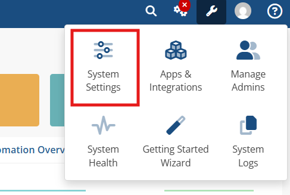
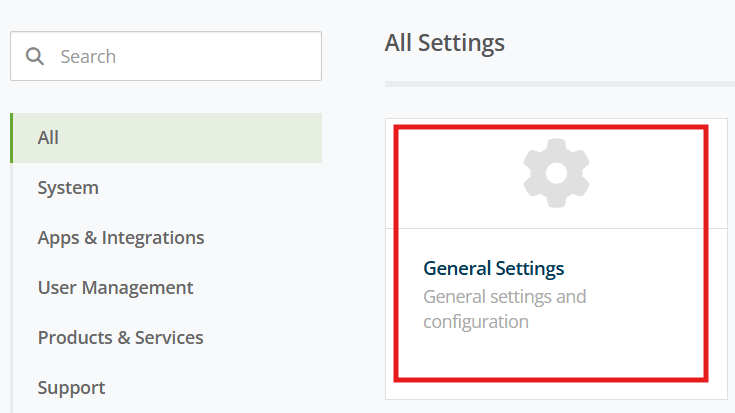
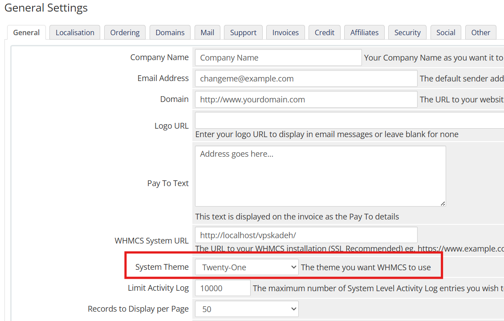
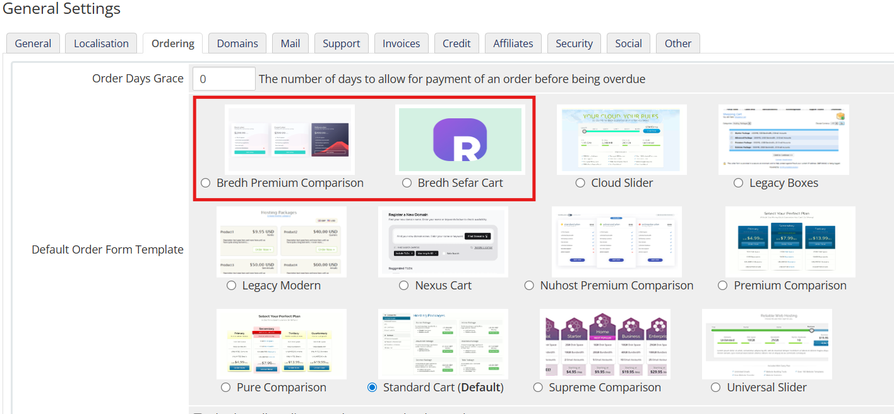

# راهنمای قالب هاستینگ برد

## ساختار فایل زیپ

```bash {2,4}
bredh
├── HTML
└── WHMCS x.x.x
    └── templates
        ├── bredh-noon
        ├── bredh-sefar
        └── orderforms

```

## نصب نسخه whmcs

برای نصب قالب پوشه `templates` را در محل نصب whmcs خود آپلود کنید.\
سپس در تنظمات عمومی و قالب و فرم سفارش را تغییر دهید. قالب 2 دمو دارد که میتوانید به دلخواه انتخاب کنید `bredh-moon` و `bred-sefar`






## نصب نسخه html

برای نصب این نسخه کافیه پوشه `HTML` را در هاست خود آپلود کنید.

:::rtnote[نکات]

1. برای شخص سازی هر دو نسخه نیازمند دانش کدنویسی هستید.
2. جهت هرگونه شخصی سازی یا راهنما از طریق [تیکت](https://www.rtl-theme.com/dashboard/#/ticket-send) در راست چین در ارتباط باشید.

:::

## شخصی سازی قالب

در بعضی از فایل ها نوشته ها به صورت `{$LANG.xxx.xxx}` است. سیستم WHMCS چند زبانه است و برای نمایش قالب به زبان مورد نظر هنگام تغییر آن در صفحه اصلی، whmcs آن را از فایل زبان خود میگیرد.\
فایل های زبان در مسیر `[whmcs_root]/langs` قرار دارند. با ویرایش این فایل ها، بعد از آپدیت whmcs همه ویرایشات به نسخه اولیه خود برمیگردند. برای ویرایش فایل های زبان مراحل زیر را دنبال کنید:

1. یک پوشه به نام `overrides` در همان مسیر `[whmcs_root]/langs` ایجاد کنید
2. فایل هر زبانی را که میخواهید ویرایش کنید را در این پوشه قرار دهید.
3. فایل را باز کنید و همه رشته های موجود از خط `if (!defined("WHMCS")) die("This file cannot be accessed directly");` به پایین را پاک کنید. (این کار ضروری نیست و فقط برای دسترسی آسان به رشته ها است)
4. برای ویرایش رشته های پیشفرض، کلمه مورد نظر را در فایل جستجو و ویرایش کنید.\
   مثال: `$_LANG['account'] = "حساب";` --> `$_LANG['account'] = "داشبورد";`\
    همچنین برای ایجاد یک رشته جدید یکی از رشته هارا برای نمونه کپی و آن را تغییر دهید.\
    مثال: `$_LANG['print'] = "پرینت";` --> `$_LANG['chap'] = "چاپ";`\
    سپس در قالب به این صورت میتوانید از آن استفاده کنید: `{$LANG.chap}`
