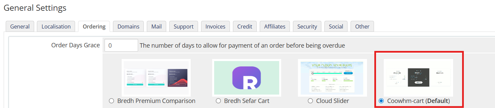

# راهنمای قالب هاستینگ coowhm

## نصب

### ساختار فایل زیپ

```bash
WHMCS x.x.x
└── templates
    ├── coowhm-plus
    ├── coowhm-style-2
    └── orderforms
```

برای نصب قالب پوشه `templates` را در محل نصب whmcs خود آپلود کنید.\
سپس در تنظمات عمومی و قالب و فرم سفارش را تغییر دهید. قالب 2 دمو دارد که میتوانید به دلخواه انتخاب کنید:

- `coowhm-old`: دموی قدیمی
- `coowhm-theme`: دموی جدید با رابط کاربری مدرن تر




:::rtnote[نکات]

1. برای شخص سازی قالب نیازمند دانش کدنویسی هستید.
2. جهت هرگونه شخصی سازی یا راهنما از طریق [تیکت](https://www.rtl-theme.com/dashboard/#/ticket-send) در راست چین در ارتباط باشید.

:::

### شخصی سازی قالب

داخل پوشه هر دو دمو یک پوشه به نام `template-parts` وجود دارد که میتوانید محتوای قالب را با آن شخصی سازی کنید.

```bash
template-parts
├── banners
│   └── banner-01.tpl    // بنر صفحه اصلی
├── elements
│   └── rtl-elements
│       ├── homepage-discount.tpl     // بنر تخفیف در پایین صفحه اصلی
│       └── ...
├── blog-loader.tpl
├── cart.tpl
├── language.tpl
└── ...
```

در بعضی از فایل ها نوشته ها به صورت `{$LANG.xxx.xxx}` است. سیستم WHMCS چند زبانه است و برای نمایش قالب به زبان مورد نظر هنگام تغییر آن در صفحه اصلی، whmcs آن را از فایل زبان خود میگیرد.\
فایل های زبان در مسیر `[whmcs_root]/langs` قرار دارند. با ویرایش این فایل ها، بعد از آپدیت whmcs همه ویرایشات به نسخه اولیه خود برمیگردند. برای ویرایش فایل های زبان مراحل زیر را دنبال کنید:

1. یک پوشه به نام `overrides` در همان مسیر `[whmcs_root]/langs` ایجاد کنید
2. فایل هر زبانی را که میخواهید ویرایش کنید را در این پوشه قرار دهید.
3. فایل را باز کنید و همه رشته های موجود از خط `if (!defined("WHMCS")) die("This file cannot be accessed directly");` به پایین را پاک کنید. (این کار ضروری نیست و فقط برای دسترسی آسان به رشته ها است)
4. برای ویرایش رشته های پیشفرض، کلمه مورد نظر را در فایل جستجو و ویرایش کنید.\
   مثال: `$_LANG['account'] = "حساب";` --> `$_LANG['account'] = "داشبورد";`\
    همچنین برای ایجاد یک رشته جدید یکی از رشته هارا برای نمونه کپی و آن را تغییر دهید.\
    مثال: `$_LANG['print'] = "پرینت";` --> `$_LANG['chap'] = "چاپ";`\
    سپس در قالب به این صورت میتوانید از آن استفاده کنید: `{$LANG.chap}`
