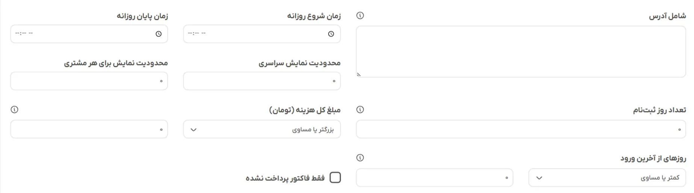
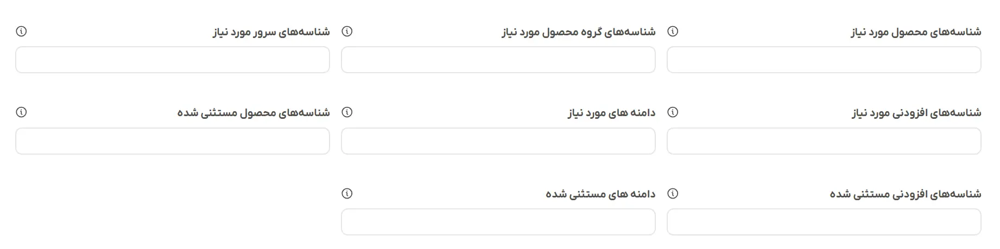
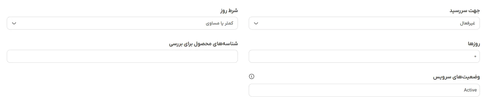

# تنظیمات پیشرفته

## محدودیت‌های پیشرفته

### شامل آدرس

یک کادر متنی چندخطی است که میتوانید در هر خط یک عبارت یا کلمه قرار دهید. برخلاف [قوانین صفحه](/elansaz-whmcs-module/configuration#%D8%B5%D9%81%D8%AD%D8%A7%D8%AA) که نام دقیق فایل‌ها را مطابقت میدهد یا از کاراکترهای جایگزین استفاده میکنند، این گزینه از یک تطابق دقیق substring استفاده میکند. افزونه مسیر کامل آدرس بازدیدکننده فعلی را میخواند و بررسی میکند که آیا عبارات شما در جایی داخل آن وجود دارد یا خیر.

- **کارکرد:** اگر در یک خط `pid=5` را وارد کنید، اعلان در `cart.php?a=add&pid=5` یا هر صفحه دیگری که دقیقاً حاوی آن رشته باشد، نمایش داده میشود.
- **مناسب برای:** هدف قرار دادن صفحات خاص محصول، آدرس سفارشی WHMCS یا لینک های ریفرال.

### زمان شروع و پایان روزانه

این فیلدها، نمایش اعلان را به ساعات خاصی از روز محدود میکنند و بر اساس زمان محلی سرور شما عمل میکنند. شما میتوانید ساعت و دقیقه دقیق را وارد کنید (مثال: 09:00 و 17:00). افزونه زمان فعلی سرور را بررسی میکند و فقط در صورتی که زمان در این فیلد قرار گیرد، به اعلان اجازه نمایش میدهد.

- **کارکرد:** این کد به اندازه کافی هوشمند است که شیفت‌های شبانه را نیز مدیریت کند. اگر زمان شروع را روی `22:00` و زمان پایان را روی `06:00` تنظیم کنید، دقیقا میداند که باید اعلان را اواخر شب و اوایل صبح روز بعد نمایش دهد.
- **مناسب برای:** اعلان‌های **"چت گفتگو آنلاین است"** یا فروش‌های ویژه.

### محدودیت نمایش سراسری

این حداکثر تعداد دفعاتی است که اعلان در کل سایت شما نمایش داده میشود. افزونه تعداد کل بازدیدهای اعلان را بررسی میکند. اگر این مقدار را روی `100` تنظیم کنید، به محض اینکه صدمین نفر آن را ببیند، پنجره به طور خودکار برای همه و برای همیشه غیرفعال میشود.

- **مناسب برای:** پیشنهادات با تعداد محدود (مثال: **50 مشتری اولی که از این کد استفاده کنند، 10% تخفیف میگیرند**)

### محدودیت نمایش برای هر مشتری

این گزینه تعداد بازدیدها را به ازای هر کاربر وارد شده به صورت جداگانه ردیابی میکند.

- **کارکرد:** از آنجا که این مورد به جای مرورگر در دیتابیس ردیابی میشود، کاربر را در دستگاه‌های مختلف دنبال میکند اگر این مقدار را روی `3` تنظیم کنید، یک مشتری میتواند آن را دو بار در تلفن خود و یک بار در دسکتاپ خود ببیند و دیگر هرگز برای او نمایش داده نخواهد شد.

### تعداد روزهای ثبت‌نام

فقط به مشتریانی که اخیراً ثبت نام کرده‌اند، اعلان نمایش داده میشود.

برای محدود کردن نمایش اعلان به ثبت‌نام‌های جدید، این گزینه را روی تعداد روز تنظیم کنید. برای مثال، عدد `7` مشخص میکند که پاپ‌آپ فقط برای مشتریانی که در `7` روز گذشته حساب کاربری خود را ایجاد کرده‌اند، نمایش داده شود.

برای غیرفعال کردن این قانون و نمایش اعلان به همه، از `0` استفاده کنید.

#### کاربردهای رایج

- نمایش تخفیف خوشامدگویی به کاربران جدید
- نمایش نکات مربوط به ثبت‌نام‌های اخیر
- هدف قرار دادن کاربرانی که تازه ثبت‌نام کرده‌اند اما هنوز سفارشی انجام نداده‌اند

:::rtnote[نکات]

- این قانون فقط برای کاربرانی که ثبت نام کرده‌اند اعمال میشود. مهمانان هرگز با فعال بودن این قانون، اعلانات را نمی‌بینند.
- این قانون با سایر قوانین نمایش کار میکند. برای اعلان، همه شرایط باید مطابقت داشته باشند.

:::

### مبلغ کل هزینه

نمایش اعلانات فقط به مشتریانی که بر اساس سابقه پرداخت خود در WHMCS، به آستانه مقدار خاصی رسیده‌اند.

- **وضعیت کل هزینه‌ها:** انتخاب مقایسه: کمتر از، کمتر از یا مساوی، مساوی، بزرگتر از یا مساوی، بزرگتر از
- **مبلغ کل هزینه شده:** مقدار را وارد کنید

برای غیرفعال کردن این قانون، مقدار را روی `0` تنظیم کنید.

#### نحوه کارکرد

این قانون کل مبلغی را که مشتری **پرداخت** کرده است در تمام فاکتورها محاسبه میکند

#### موارد استفاده

- **پیشنهادهای ویژه:** نمایش پیشنهادهای ویژه ارتقاء به مشتریانی که بیش از مبلغ مشخصی هزینه کرده‌اند.
- **پیام‌های خوش‌آمدگویی:** نمایش اعلانات برای مشتریانی که هزینه کلی کمی دارند.
- **پیام های حفظ مشتری:** هدف قرار دادن مشتریان با ارزش بالا با پیشنهادهای ویژه تمدید یا وفاداری.
- **تبلیغات افزایش فروش:** نمایش پیشنهادهای مرتبط به مشتریانی که قبلاً در سرویس های شما سرمایه‌گذاری کرده‌اند.

### روز از آخرین ورود

نمایش اعلان فقط به مشتریان بر اساس آخرین ورود آنها.

#### موارد استفاده

- **کمپین‌های تعامل مجدد:** نمایش پیشنهادات ویژه به مشتریانی که مدتی است وارد سیستم نشده‌اند تا آنها را برگردانند.
- **پیام‌های خوشامدگویی:** نمایش یک پیام تبریک شخصی‌سازی‌شده به مشتریانی که پس از غیبت طولانی بازمی‌گردند.
- **پاداش‌های وفاداری:** هدف قرار دادن مشتریان فعال همیشگی با پیشنهادات ویژه.
- **پیشگیری از ریزش:** شناسایی و ارتباط با مشتریانی که فعالیت ورود به سیستم آنها کاهش یافته است.

### فقط فاکتور پرداخت نشده

نمایش اعلان فقط برای مشتریان با فاکتور پرداخت نشده.

- **کارکرد:** اگر تیک خورده باشد، افزونه بررسی میکند که آیا کاربر فعلی فاکتوری با وضعیت پرداخت نشده دارد یا خیر. اگر فاکتور پرداخت نشده نداشته باشد، اعلان فوراً مسدود میشود.
- **مناسب برای:** یادآوری‌های قاطع به مشتریان، مبنی بر اینکه قبل از تعلیق سرویس، باید صورتحساب‌های خود را پرداخت کنند.

## محدودیت‌های محصول، افزودنی و دامنه

این تب یک ابزار بازاریابی قدرتمند است که به شما امکان میدهد مشتریان وارد شده را بر اساس محصولات، افزودنی یا دامنه‌های خاصی که در حال حاضر دارند، هدف قرار دهید.

این تب به طور خاص برای فروش بیشتر (up-selling) و فروش متقابل (cross-selling) طراحی شده است. این سیستم، کوئری‌های همزمان (real-time) را در پایگاه داده WHMCS شما اجرا میکند تا وضعیت دقیق **فعال** بودن سرویس‌های مشتری را بررسی کند.

هر فیلد در این تب، فهرستی از شناسه‌ها یا متن‌های جدا شده با کاما `1, 4, 12 - .com, .net` را میپذیرد. اگر فیلدی را خالی بگذارید، آن محدودیت نادیده گرفته میشود.

### شناسه‌های محصول مورد نیاز - شناسه‌های گروه محصول مورد نیاز - شناسه‌های سرور مورد نیاز - شناسه‌های افزودنی مورد نیاز - دامنه های مورد نیاز

اگر هر یک از این فیلدها را پر کنید، مشتری باید حداقل یکی از موارد مشخص شده را در وضعیت فعال داشته باشد تا بتواند اعلان را ببیند. اگر سرویس آنها در حال انتظار، تعلیق شده یا خاتمه یافته باشد، این ویژگی غیرفعال میشود.

- **شناسه‌های محصول مورد نیاز:** دیتابیس را بررسی میکند تا ببیند آیا مشتری سرویس فعالی دارد که با شناسه دقیق محصول مطابقت دارد یا خیر.
  - **مناسب برای:** ارسال یک اطلاعیه خاص به کاربرانی که مالک سرویس "xyz" هستند.
- **شناسه‌های گروه محصول مورد نیاز:** گروه محصولات را بررسی میکند.
  - **مناسب برای:** هدف قرار دادن همه مشتریان **میزبانی اشتراکی**، صرف نظر از اینکه کدام سطح یا پلن خاص را خریداری کرده‌اند
- **شناسه‌های سرور مورد نیاز:** بررسی میکند که سرویس مشتری به کدام سرور اختصاص داده شده است.
  - **مناسب برای:** اعلام تعمیرات، تغییرات آی پی یا مهاجرت برای کاربران میزبانی شده در **سرور xyz**
- **شناسه‌های افزودنی مورد نیاز:** دیتابیس را بررسی میکند تا ببیند آیا مشتری افزودنی فعالی برای محصول دارد یا خیر.
  - **مناسب برای:** اطلاعیه‌های مربوط به آی پی اختصاصی، سرویس‌های پشتیبان‌گیری یا گواهینامه‌های SSL که به عنوان افزودنی خریداری کرده‌اند.
- **دامنه های مورد نیاز:** دیتابیس را برای دامنه‌های فعال که به پسوندهای خاص (مانند com یا ir) ختم میشوند، بررسی میکند.
  - **مناسب برای:** اعلام افزایش قیمت برای تمدید دامنه‌های net به طور خاص برای افرادی که دامنه‌های net دارند.

### شناسه‌های محصول مستثنی شده - شناسه‌های افزودنی مستثنی شده - دامنه های مستثنی شده

این فیلدها به عنوان فیلترهای منفی عمل میکنند. اگر این فیلدها را پر کنید، مشتری **نباید** این موارد را فعال داشته باشد. اگر حتی یکی از این موارد را داشته باشد، اعلان مسدود میشود.

- **شناسه‌های محصول مستثنی شده:** اگر مشتری از قبل مالک این محصول باشد، اعلان را مسدود میکند.
- **شناسه‌های افزودنی مستثنی شده:** اگر مشتری از قبل این افزونه را داشته باشد، اعلان را مسدود میکند.
- **دامنه های مستثنی شده:** اگر مشتری از قبل مالک این دامنه باشد، اعلان را مسدود میکند.

### مثال

تصور کنید که میخواهید یک کمپین افزایش فروش (upselling) اجرا کنید: **یک ای پی اختصاصی به سرور با قیمت 3 میلیون تومان در ماه اضافه کنید**.\
شما نمیخواهید این اعلان را به افرادی که قبلاً یک ای پی اختصاصی خریداری کرده‌اند نشان دهید، و نمیخواهید آن را به افرادی که فقط دامنه خریداری کرده‌اند نشان دهید (زیرا آنها سروری برای اتصال آن ندارند).

**نحوه پیکربندی فیلدها:**

1. **شناسه‌های گروه محصول مورد نیاز:** `1` (برفرض اینکه **1** گروه مشتری هاستینگ شماست. اکنون فقط مشتریان میزبانی آن را میبینند)
1. **دامنه های مورد نیاز:** `5` (برفرض اینکه **5** مربوط به افزودنی آی پی اختصاصی شما باشد، اکنون افزونه، اعلان را از دید کسانی که قبلاً آن را خریداری کرده‌اند، پنهان میکند)

## محدودیت‌های تاریخ سررسید

این تب به شما این امکان را میدهد که اعلان ها را بر اساس برنامه تمدید (تاریخ سررسید بعدی) سرویس‌های یک مشتری وارد شده فعال کنید.

این قابلیت برای ارسال خودکار یادآوری‌های **سرویس شما به زودی منقضی میشود** یا هشدارهای **سررسید سرویس شما گذشته است** در ناحیه کاربری فوق‌العاده مفید است.

افزونه تعداد دقیق روزهای بین **امروز** و تاریخ سررسید سرویس را محاسبه میکند و سپس یک مقایسه انجام میدهد.

### جهت سررسید - شرط روز - روزها

این سه فیلد با هم کار میکنند تا یک فرمول ریاضی ایجاد کنند که زمان نمایش اعلان را تعیین میکند.

- **جهت سررسید:** این به عنوان سوئیچ اصلی برای تب عمل میکند. میتوانید آن را به صورت زیر تنظیم کنید:
  - **غیرفعال:** کل تب غیرفعال میشود.
  - **قبل از تاریخ سررسید:** تمدیدهای آتی را بررسی میکند.
  - **در تاریخ سررسید:** دقیقاً زمانی که شمارش معکوس به 0 روز برسد، فعال میشود.
  - **بعد از تاریخ سررسید:** سرویس های معوقه ررا بررسی میکند.

- **شرط روز:** عملگر ریاضی. میتوانید **کمتر از**، **کمتر یا مساوی**، **برابر با**، **بزرگتر یا مساوی** یا **بزرگتر از** را انتخاب کنید.
- **روزها:** تعداد عددی روزهایی که میخواهید با آنها مقایسه کنید.

### شناسه‌های محصول برای بررسی - وضعیت‌های سرویس

از آنجا که یک مشتری ممکن است 10 سرویس مختلف با 10 تاریخ سررسید متفاوت داشته باشد، این فیلدها دقیقاً به افزونه میگویند که کدام سرویس‌ها را در دیتابیس بررسی کند.

- **شناسه‌های محصول برای بررسی:** فهرستی از شناسه‌های محصولات که با کاما از هم جدا شده‌اند. اگر عدد `5` را وارد کنید، افزونه فقط تاریخ سررسید محصول با شناسه **5** را بررسی میکند. اگر این قسمت را خالی بگذارید، افزونه تاریخ سررسید تک تک سرویس‌هایی که مشتری در اختیار دارد را بررسی میکند.
- **وضعیت‌ سرویس:** بطور پیشفرض، این گزینه روی `Active` تنظیم شده است. این کار تضمین میکند که به طور تصادفی به مشتری یادآوری نکنید که سرویسی را که قبلاً به عنوان `Terminated` یا `Cancelled` علامت‌گذاری شده است، تمدید کند. میتوانید چندین وضعیت مانند `Active`, `Suspended` را وارد کنید.

### مثال

برای اینکه در این موارد آسان‌تر شود، در اینجا نحوه پیکربندی دو سناریوی رایج توضیح داده شده است:

**سناریو 1: "دامنه یا میزبانی شما 7 روز یا کمتر دیگر منقضی میشود همین حالا تمدید کنید."**

- "**جهت سررسید:** قبل از تاریخ سررسید
- **شرط روز:** کمتر یا مساوی
- **روز:** 7
- اگر روزهای باقی مانده تا تاریخ سررسید 7 روز یا کمتر باشد، اعلان نمایش داده میشود. (در روز 7، روز 6، روز 5 و غیره نشان داده خواهد شد).

**سناریو 2: "سرویس شما 3 روز عقب افتاده و در معرض خطر تعلیق است"**

- **جهت سررسید:** بعد از تاریخ سررسید
- **شرط روز:** بزرگتر یا مساوی
- **روز:** 3
- اگر روزهای گذشته از تاریخ سررسید 3 روز یا کمتر باشد، اعلان نمایش داده میشود.
