## اعلان ها

:::rtnote[نکات]

- تغییر زبان مدیریت فقط روی صفحه افزونه تأثیر می‌گذارد. زبان اعلان مشتری از زبان فعلی ناحیه کاربری WHMCS پیروی میکند.
- از بنر نوع بالا با اولویت بالا برای اعلان‌های مهم استفاده کنید.
- اعلان‌های تعمیر و نگهداری را به صفحات وضعیت شبکه، داشبورد یا سبد خرید محدود کنید.
- فقط اعلان مطابق با بالاترین اولویت در صفحه نمایش داده میشود، بنابراین بازدیدکنندگان با چندین اعلان همزمان مواجه نمی‌شوند.
- در صفحه اصلی فقط نوع `Popup` فعال است و اگر `Notification` انتخاب شود صفحه اصلی غیرفعال است و بالعکس.

:::

## لیست اعلان ها

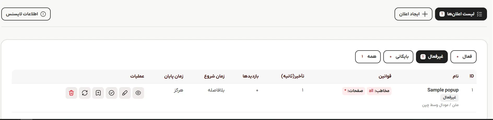

در تب لیست اعلان ها میتوانید نمای کلی اعلان فعال فعلی خود را مشاهده کنید.

- **نام:** نام، وضعیت، نوع و استایل اعلان
- **قوانین:** شرط نمایش اعلان شامل صفحه نمایش و مخاطب
- **تاخیر:** مدت زمان تاخیر نمایش اعلان بر حسب ثانیه
- **زمان شروع:** تاریخ و زمان شروع نمایش اعلان
- **زمان پایان:** تاریخ و زمان پایان نمایش اعلان
- **عملیات:** شامل عملیات هایی که میتوانید روی اعلان انجام دهید
  - **پیشنمایش:** این گزینه یک پیشنمایش از اعلان ایجاد شده در پنل افزونه ایجاد میکند
  - **ویرایش:** ویرایش اعلان
  - **فعالسازی:** در صورت غیرفعال بودن اعلان، آن را فعال و در صورت فعال بودن، آن را غیرفعال میکند
  - **بایگانی:** به جای پاک کردن دائمی اعلان، بایگانی کردن، آن را به طور ایمن پنهان میکند.
  - **ریسیت آمار:** آمار اعلان(بازدید، کلیک ها) را صفر میکند
  - **حذف:** اعلان ساخته شده را حذف میکند

## ساخت اعلان جدید

## تنظیمات عمومی

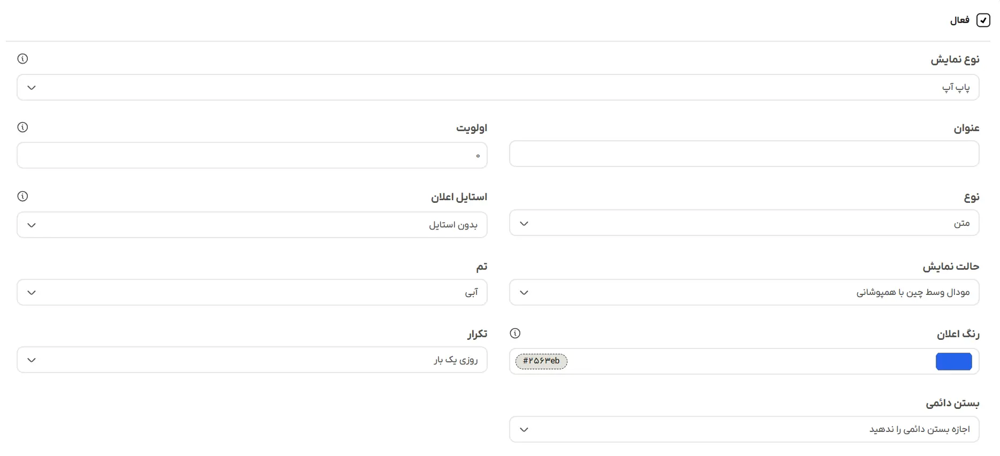

### فعالسازی

در صورت فعال بودن، اعلان پس از ذخیره فعال و در غیراینصورت در تب موارد غیرفعال ظاهر میشود.

### نوع نمایش اعلان

نوع نمایش اعلان را مشخص میکند:

- **پاپ آپ(Popup):** این نوع به صورت شناور در صفحه ظاهر میشود و درصورت انتخاب، پس‌زمینه خود را کاملا میپوشاند
  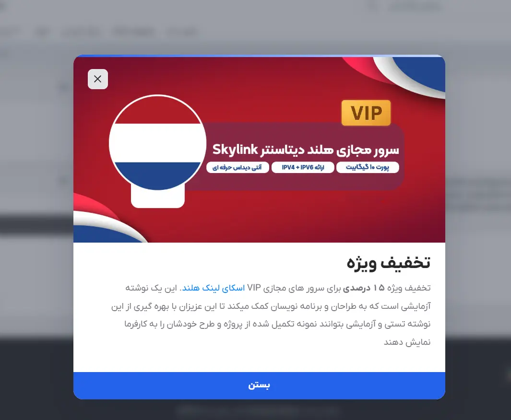
- **اعلان(Notification):** این نوع اعلان در محتوای صفحه ظاهر میشود.
  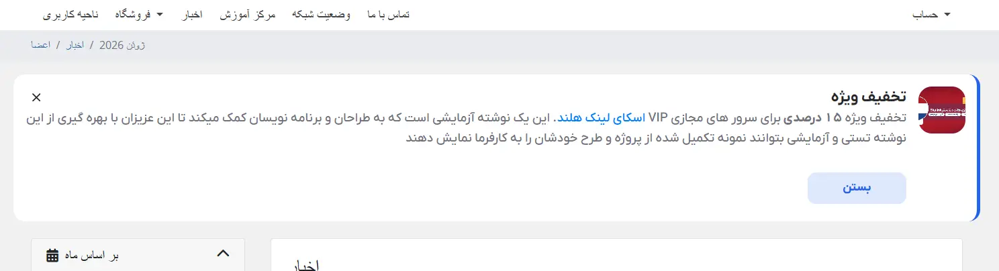

### عنوان

نام اعلان ساخته شده. فقط برای بخش مدیریت استفاده میشود، این نام در جدول لیست اعلان‌ها فهرست خواهد شد.

### اولویت

اولویت نمایش اعلان در صفحه را مشخص میکند. اگر وارد نشود آخرین اعلان ساخته شده به عنوان بالاترین اولویت در نظر گرفته و نمایش داده میشود.

### فرمت اعلان

- **متن:**
  در این فرمت ارجعیت با محتوای متنی است و در صورتی که تصویر هم همراه آن آپلود شود تصویر در انداره کوچک در سمت راست و متن در سمت چپ قرار میگیرد
  - نوع `Popup`
    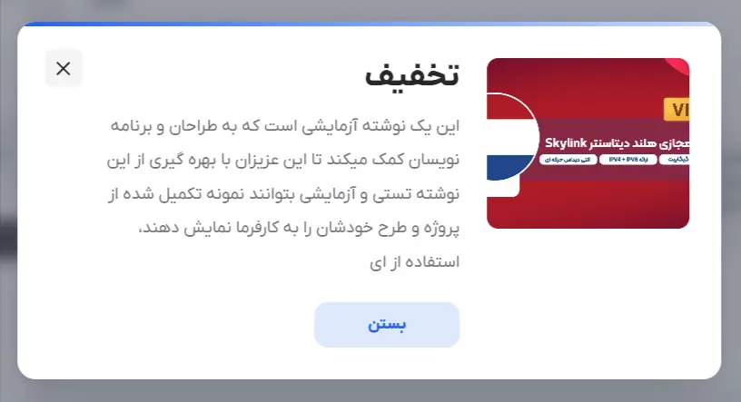
  - نوع `Notification`
    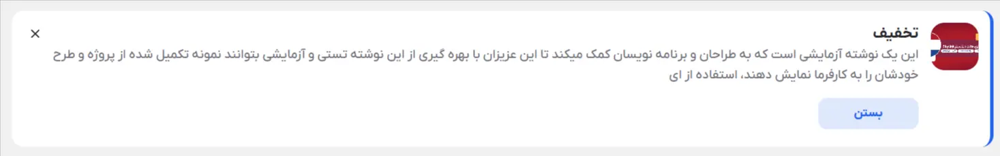

- **تصویر:**
  این فرمت مراتب بصری را تغییر می‌دهد. تصویر را به طور برجسته و در اندازه بزرگ در بالای اعلان نمایش می‌دهد. اگر عنوان یا متن را اضافه شده باشد، آنها را در زیر تصویر نمایش می‌دهد. در غیراینصورت، فقط یک بنر تصویری تمیز و مستقل با یک دکمه بستن نمایش می‌دهد.
  - نوع `Popup`
    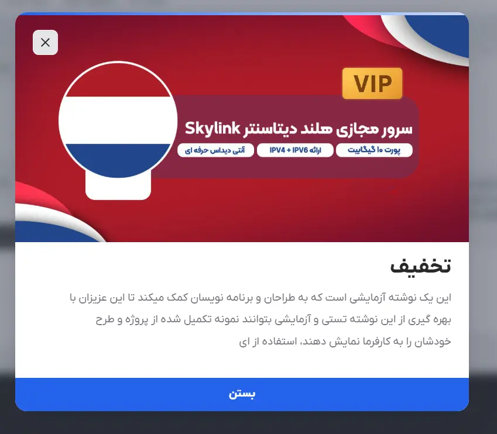
  - نوع `Notification`
    

### استایل اعلان

استایل اعلان را مشخص میکند.

:::rtnote[نکته]

- این استایل ها آماده هستند و با انتخاب یکی از آن ها، فیلدهای [حالت نمایش](/elansaz-whmcs-module/configuration#%D8%AD%D8%A7%D9%84%D8%AA-%D9%86%D9%85%D8%A7%DB%8C%D8%B4)، تم، اندازه و انیمیشن نادیده گرفته میشود. برای انتخاب دلخواه این موارد گزینه بدون استایل را انتخاب کنید.
- با تغییر نوع نمایش به `Notification` این گزینه غیرفعال میشود

:::

مشخصات استایل ها:

- مودال وسط چین
  - **تم رنگی:** آبی
  - **عرض:** 620 پیکسل
  - **ارتفاع:** خودکار
  - **انیمیشن:** محو
  - **مدت زمان انیمیشن:** 180 میلی ثانیه
  - **کد CSS شخصی:** ندارد

- بنر
  - **تم رنگی:** قرمز
  - **عرض:** 580 پیکسل
  - **ارتفاع:** خودکار
  - **انیمیشن:** محو
  - **مدت زمان انیمیشن:** 200 میلی ثانیه
  - **کد CSS شخصی:** `{root} .es-panel{border-radius:16px;overflow:hidden}\n{root} .es-poster-close{background:#e11d48}`

- بنر بالا
  - **تم رنگی:** سبز
  - **عرض:** 980 پیکسل
  - **ارتفاع:** خودکار
  - **انیمیشن:** اسلاید از بالا
  - **مدت زمان انیمیشن:** 180 میلی ثانیه
  - **کد CSS شخصی:** `{root} .es-panel{border-radius:6px}\n{root} .es-accent{height:3px}`

- بنر پایین
  - **تم رنگی:** خاکستری فیلی(slate)
  - **عرض:** 980 پیکسل
  - **ارتفاع:** خودکار
  - **انیمیشن:** اسلاید از پایین
  - **مدت زمان انیمیشن:** 180 میلی ثانیه
  - **کد CSS شخصی:** ندارد

- گوشه سمت راست
  - **تم رنگی:** نارنجی
  - **عرض:** خودکار
  - **ارتفاع:** خودکار
  - **انیمیشن:** اسلاید از راست
  - **مدت زمان انیمیشن:** 180 میلی ثانیه
  - **کد CSS شخصی:** `{root} .es-panel{border-radius:16px;box-shadow:0 18px 42px rgba(15,23,42,.20)}`

### حالت نمایش

محل قرار گیری اعلان در صفحه را مشخص میکند

:::rtnote[نکته]

- این گزینه بیشتر برای نوع `Popup` کاربرد دارد.
- با تغییر [نوع نمایش](/elansaz-whmcs-module/configuration#%D9%86%D9%88%D8%B9-%D9%86%D9%85%D8%A7%DB%8C%D8%B4-%D8%A7%D8%B9%D9%84%D8%A7%D9%86) به `Notification` فقط حالت **بنر بالا** فعال میماند.

:::

- مودال وسط چین با همپوشانی
  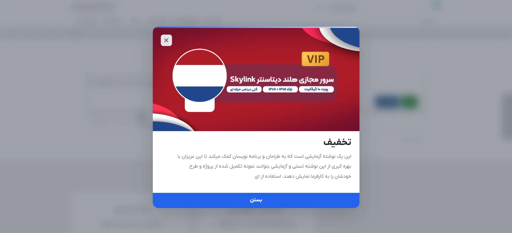
- بنر بالا
  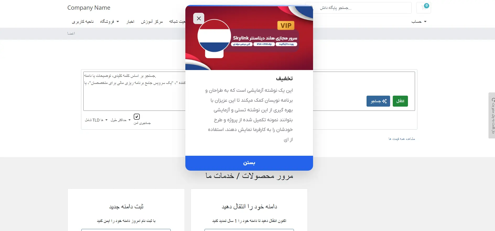
- بنر پایین
  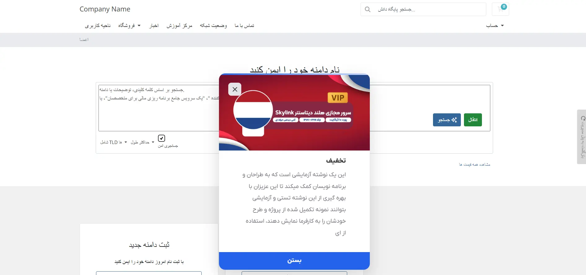
- پایین سمت راست
  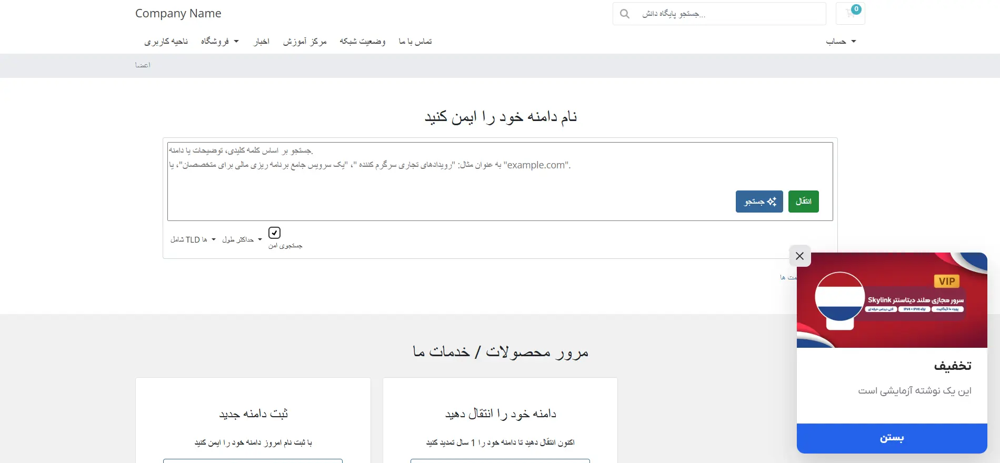
- پایین سمت چپ
  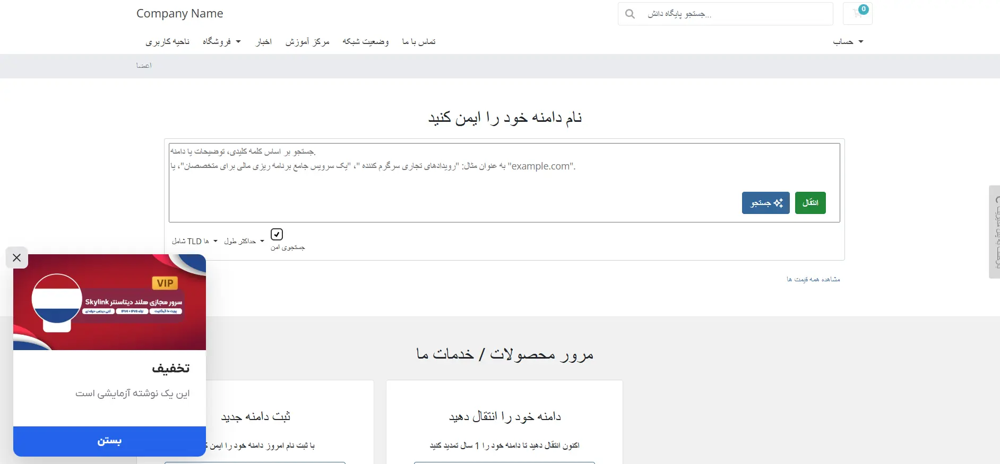
- سمت راست
  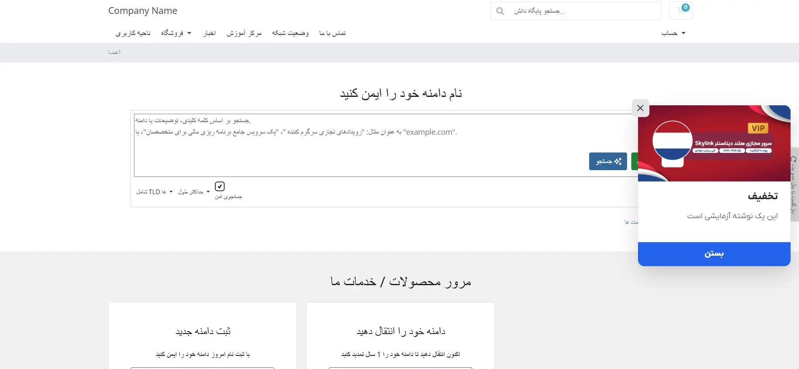
- سمت چپ
  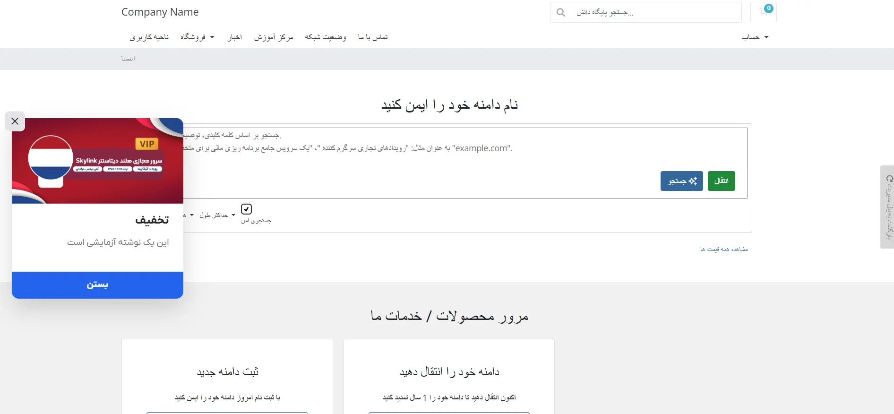

### تم رنگی

طیف رنگ اعلان را مشخص میکند. این لیست رنگ ها آماده هستند. برای انتخاب رنگ دلخواه [رنگ اعلان](/elansaz-whmcs-module/configuration#%D8%B1%D9%86%DA%AF-%D8%A7%D8%B9%D9%84%D8%A7%D9%86) را تغییر دهید.

### رنگ اعلان

رنگ دلخواه برای عناصر برجسته و مهم اعلان.

### تکرار

فیلد تکرار مشخص میکند که یک پاپ آپ یا اعلان چند وقت یکبار به بازدیدکننده نشان داده شود.

- **هر بازدید:** سیستم به طور کامل حافظه مرورگر را نادیده می‌گیرد. هر بار که کاربر صفحه‌ را بارگیری یا به‌روزرسانی کند، اعلان فعال میشود.
  - **مناسب برای:** هشدارهای بسیار حیاتی، مانند **سرور تا 5 دقیقه دیگر تعمیر میشود** یا **فاکتور شما معوق است**، که در آن‌ها باید تضمین کنید که کاربر صرف نظر از صفحه‌ای که روی آن کلیک میکند، آن را میبیند.
- **یکبار در هر session:** اعلان اولین باری که کاربر وارد صفحه‌ میشود، نمایش داده میشود. با کلیک کردن کاربر روی دکمه بستن، خروج یا خارج از اعلان، دیگر نمایش داده نمیشود. با این حال، اگر کاربر تب مرورگر خود را ببندد و چند ساعت بعد به سایت بازگردد، اعلان دوباره فعال میشود.
  - **مناسب برای:** فروش‌های موقت یا اطلاعیه‌های روزانه عمومی.
- **روزی یکبار:** اعلان دقیقاً یک بار نمایش داده میشود. پس از آن، مرورگر یک تایمر 24 ساعته تنظیم میکند. مهم نیست کاربر چند بار از سایت شما بازدید کند، مرورگر خود را رفرش کند یا ببندد، او دیگر اعلان را تا روز بعد نخواهد دید.
  - **مناسب برای:** جوایز روزانه، یادآوری تخفیف‌های دوره‌ای یا کمپین‌های بازاریابی که در آن‌ها میخواهید بدون ایجاد مزاحمت، به کاربر یادآوری کنید.
- **یکبار در هر مرورگر:** اعلان فقط یکبار برای کاربر نمایش داده میشود. پس از اجرا، کاربر دیگر هرگز اعلان را نخواهد دید، مگر اینکه کوکی‌ها/حافظه پنهان مرورگر خود را به صورت دستی پاک کند یا شما یک اعلان جدید ایجاد کنید.
  - **مناسب برای:** پیام‌های خوشامدگویی برای مشتریان جدید، اطلاعیه‌های انتشار ویژگی‌های جدید.

:::rtnote[تعامل با تیک بستن دائمی]

به خاطر داشته باشید که اگر گزینه‌ی [پنهان کردن دائمی](/elansaz-whmcs-module/configuration#%D8%A8%D8%B3%D8%AA%D9%86-%D8%AF%D8%A7%D8%A6%D9%85%DB%8C) را فعال کنید، به عنوان یک گزینه‌ی جایگزین عمل میکند. برای مثال، اگر تعداد دفعات نمایش **روزی یکبار در روز** تنظیم شده باشد، اما کاربر روی گزینه‌ی **دیگر این را نشان نده** در اعلان کلیک کند، افزونه تعداد دفعات نمایش را به **یکبار در هر مرورگر** تبدیل میکند و نمایش آن را به طور کامل برای کاربر متوقف میکند.

:::

### بستن دائمی

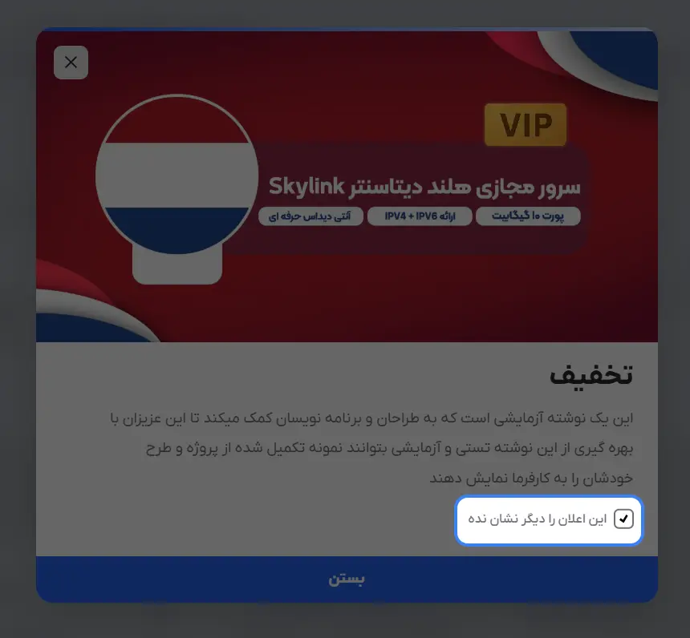

بستن دائمی تعیین میکند که آیا بازدیدکننده مجاز است از فیلد [تکرار](/elansaz-whmcs-module/configuration#%D8%AA%DA%A9%D8%B1%D8%A7%D8%B1) را صرف نظر و اعلان را برای همیشه از صفحه‌ی خود حذف کند یا خیر.\
در حالی که فیلد [تکرار](/elansaz-whmcs-module/configuration#%D8%AA%DA%A9%D8%B1%D8%A7%D8%B1) ظاهر شدن خودکار یک اعلان را کنترل میکند، بستن دائمی کنترل را مستقیماً در دست کاربر قرار میدهد.

- **اجازه بستن دائمی را ندهید(غیرفعال):** این کار قابلیت بستن دائمی را غیرفعال میکند. کاربر هیچ راهی برای جلوگیری از بازگشت اعلان ندارد. حتی اگر روی دکمه **بستن** کلیک کند، اعلان دقیقاً مطابق با تنظیمات اعلان دوباره ظاهر میشود.
- **دکمه بستن برای همیشه اعلان را پنهان میکند(بستن):** این گزینه دکمه‌ی بستن استاندارد **X** (یا دکمه‌ی بستن ثانویه‌) را به یک دکمه‌ی بستن دائمی تبدیل میکند. به محض اینکه کاربر روی دکمه‌ی بستن کلیک کند، افزونه حتی اگر تکرار روی **هر بازدید** یا **روزانه** تنظیم شده باشد، اعلان دیگر هرگز برای او نمایش داده نخواهد شد.
- **نمایش چک باکس بستن دائمی(چک باکس):** این گزینه یک تیک انتخاب **دیگر این را نشان نده** را به اعلان اضافه میکند. اگر کاربر فقط روی **X** برای بستن پنجره کلیک کند، بر اساس تنظیم فیلد تکرار نمایش داده میشود. با این حال، اگر قبل از بستن آن، کادر انتخاب را علامت بزند، پنجره برای همیشه حذف میشود.

## اندازه و انیمیشن

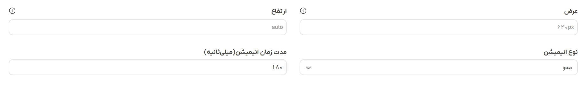

### عرض و ارتفاع

عرض و ارتفاع اعلان را تعیین میکند. میتوانید از `%` یا `px` استفاده کنید`580px, 60%` و یا برای حالت خودکار آن را خالی بگذارید.

### نوع انیمیشن

نوع انیمیشن ظاهر شدن اعلان را تعیین میکند.

- **محو**
- **اسلاید از چپ**
- **اسلاید از راست**
- **اسلاید از بالا**
- **اسلاید از پایین**
- **بدون انیمیشن**

### مدت زمان انیمیشن

مدت زمان ظاهر شدن اعلان(transition). بر حسب میلی ثانیه

<video width="840" height="400" controls>
  <source src="../../img/elansaz/animation.mp4" type="video/mp4"></source>
</video>

## محتوای اعلان

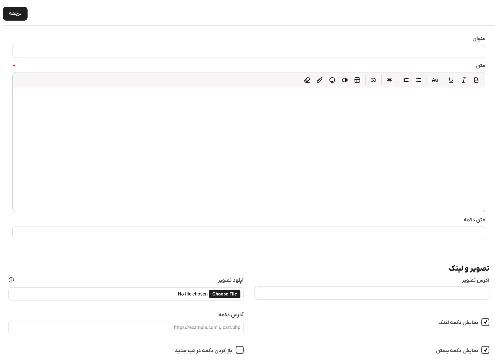

ماژول از همه زبان های موجود در whmcs پشتیبانی میکند.

:::rtnote[نکات]

- اگر فیلد ترجمه یکی از زبان‌ها را را خالی بگذارید، آن زبان به مقدار پیشفرض برمی‌گردد. پس شما نیازی به کپی کردن محتوا ندارید.
- یک اعلان میتواند به همه مشتریان شما به زبان خودشان خدمات ارائه دهد.
- ترجمه‌ها در دیتابیس ذخیره شده و به طور بهینه بارگذاری میشوند.
- اگر قبلاً متن انگلیسی را در فیلدهای جداگانه وارد کرده‌اید، به طور خودکار به سیستم ترجمه منتقل شده است

:::

### عنوان

عنوان اصلی اعلان. اگر [فرمت](/elansaz-whmcs-module/configuration#%D9%81%D8%B1%D9%85%D8%AA-%D8%A7%D8%B9%D9%84%D8%A7%D9%86) روی **متن** تنظیم شده باشد، معمولاً در یک عنوان پررنگ قرار میگیرد.

### ترجمه

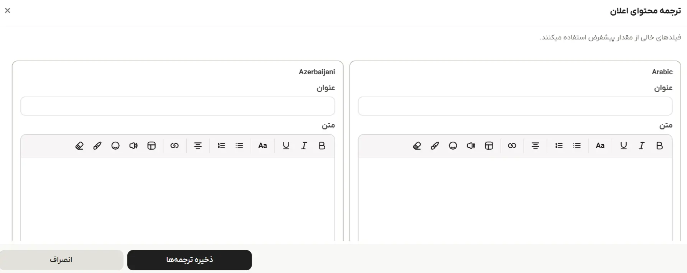

میتوانید عنوان، محتوا و عنوان دکمه اعلان را با کلیک روی **ترجمه** به زبان مورد نظر خود ترجمه کنید.\
هر اعلان یک **مقدار پیشفرض** دارد (عنوان اصلی، محتوا و متن دکمه). وقتی مشتری از سایت شما بازدید میکند، ماژول خودکار زبان او را تشخیص میدهد و در صورت وجود، نسخه ترجمه شده را نمایش میدهد. اگر ترجمه‌ای در دسترس نباشد، مقدار پیشفرض نمایش داده میشود.

این یعنی شما فقط باید زبان‌هایی را که لازم دارید را وارد کنید. بقیه زبان‌ها به طور خودکار به حالت پیشفرض برمی‌گردند.

### متن

این نوشته اصلی اعلان است که قدرت گرفته از ویرایشگر متن [TipTap](https://tiptap.dev/) است. میتوانید همه نوع شخصی سازی روی متن خود انجام دهید. بولد، لیست، درج لینک، جدول، صوت، ایموجی و...

:::rtnote[توجه]

اگر [فرمت](/elansaz-whmcs-module/configuration#%D9%81%D8%B1%D9%85%D8%AA-%D8%A7%D8%B9%D9%84%D8%A7%D9%86) روی **تصویر** تنظیم شده باشد، 2 فیلد عنوان و متن اختیاری است.

:::

### متن دکمه

متنی که درون دکمه‌ی اصلی نمایش داده میشود. این متن باید با آدرس دکمه جفت شود؛ اگر یکی را پر کنید، افزونه از شما میخواهد که دیگری را هم پر کنید.

### تصویر

این فیلدها تصویر اعلان شما را تعیین میکنند و در همه زبان‌ها مشترک است.

**آدرس تصویر:** یک لینک مستقیم به یک تصویر خارجی

**آپلود تصویر:** به شما امکان میدهد تصویر را مستقیماً در سرور WHMCS خود به آدرس `/modules/addons/elansaz/assets/images/` آپلود کنید. از فرمت های `JPG, PNG, GIF, WEBP, SVG` تا حجم 4 مگابایت پشتیبانی میکند.

:::rtnote[توجه]

- آپلود تصاویر svg در افزونه پیشفرض غیرفعال است و باید هنگام نصب آن را فعال کنید. فایل‌های svg میتوانند حاوی کدهای اجرایی و مخرب باشند. فقط در صورتی که به مدیران در آپلود فایل‌ها اعتماد دارید، این گزینه را فعال کنید.
- اگر فرمت روی **تصویر** تنظیم شده باشد، باید یا آدرس تصویر یا یک تصویر آپلود کنید. به هر دو نیاز ندارید.

:::

### نمایش دکمه

یک سوئیچ برای دکمه‌ی اصلی اعلان. اگر این گزینه را غیرفعال کنید، دکمه‌ی اصلی از اعلان پنهان میشود و فیلدهای **متن دکمه**، **آدرس دکمه** و تیک **بازکردن در تب جدید** از پنل افزونه پنهان میشوند.

### نمایش دکمه بستن

این گزینه مشخص میکند که آیا دکمه ثانویه رد کردن یا بستن در کنار دکمه اصلی شما ظاهر شود.

:::rtnote[توجه]

دکمه بستن با آیکون **X** در گوشه بالا متفاوت است. این آیکون دکمه نوشتاری پایین را کنترل میکند.

:::

### آدرس دکمه

لینک مقصد برای دکمه اصلی اعلان. میتواند یک لینک خارجی یا یک لینک داخلی از سایت خود شما باشد.

### باز کردن دکمه در تب جدید

اگر علامت زده شود، وقتی کاربر روی دکمه اصلی کلیک کند، لینک در یک تب مرورگر جدید باز میشود.

## قوانین نمایش

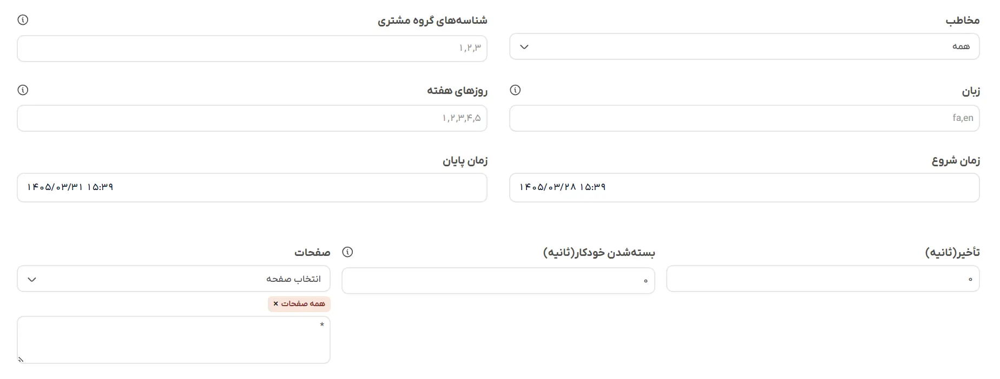

### مخاطب

فیلتر برای بازدیدکنندگان شما. میتوانید از بین چهار گزینه انتخاب کنید:

- **همه:** به همه نشان داده میشود، چه وارد سایت شده باشند و چه نشده باشند.
- **فقط مهمانان:** فقط به بازدیدکنندگانی نشان داده میشود که وارد حساب خود نشده‌اند.
- **مشتریان وارد شده:** فقط به کاربرانی نشان داده میشود که وارد حساب کاربری خود شده‌اند.
- **گروه های خاص مشتری:** نمایش اعلان را به کاربرانی که به گروه‌های خاصی از مشتریان تعلق دارند، محدود میکند.

### شناسه‌های گروه مشتری

اگر **گروه‌های خاص مشتری** را انتخاب کرده‌اید، باید فهرستی از شناسه‌های گروه را که با کاما از هم جدا شده‌اند را اینجا وارد کنید. اگر مخاطب روی هر چیز دیگری تنظیم شده باشد، افزونه این فیلد را نادیده میگیرد.

### زبان

اعلان را بر اساس زبان فعال WHMCS کاربر محدود میکند. میتوانید `fa` یا `en` را وارد کنید. خالی گذاشتن این فیلد به این معنی است که اعلان برای همه زبان‌ها نمایش داده میشود.

### روزهای هفته

نمایش اعلان را به روزهای خاصی محدود میکند. 1 برای شنبه و 7 برای جمعه است. خالی گذاشتن آن به این معنی است که هر روز اجرا میشود.

### تاریخ شروع

تاریخ و زمان دقیق شروع نمایش اعلان. قبل از این تاریخ، پاپ‌آپ مخفی خواهد ماند.

### تاریخ پایان

تاریخ و زمان دقیق پایان نمایش اعلان را نشان میدهد. پس از گذشت این تاریخ، اعلان به‌طور خودکار غیرفعال میشود.

### تاخیر

مدت زمانی که افزونه پس از بارگذاری صفحه و قبل از نمایش اعلان منتظر میماند. میتوانید این مقدار را بین 0 تا 60 ثانیه تنظیم کنید.

:::rtnote[نکته]

اگر [نوع نمایش](/elansaz-whmcs-module/configuration#%D9%86%D9%88%D8%B9-%D9%86%D9%85%D8%A7%DB%8C%D8%B4-%D8%A7%D8%B9%D9%84%D8%A7%D9%86) در تب تنظیمات روی **اعلان** تنظیم شده باشد، این فیلد به‌طور خودکار غیرفعال شده و به 0 تغییر میکند

:::

### بسته‌شدن خودکار

به عنوان یک تایمر خود تخریب عمل میکند. میتوانید آن را تا 3600 ثانیه تنظیم کنید. اگر عدد 0 را وارد کنید، اعلان به طور نامحدود روی صفحه باقی میماند تا زمانی که بازدیدکننده به صورت دستی روی دکمه بستن کلیک کند.

### صفحات

- **انتخابگر صفحات:** یک ابزار کمکی که شامل لیستی از صفحات از پیش تعریف شده WHMCS است. انتخاب یک گزینه از این منوی کشویی به طور خودکار مسیر آدرس صحیح را در کادر متنی پایین برای شما درج میکند.
- **کادر متنی:** یک کادر متنی چند خطی که در آن صفحات دقیق WHMCS که باید اعلان را بارگذاری کنند، تعریف میکنید. هر صفحه در یک خط باید قرار گیرد. برای مثال، `cart.php` یا `clientarea.php?action=services`. استفاده از ستاره `*` به این معنی است که در همه صفحات بارگذاری خواهد شد.
