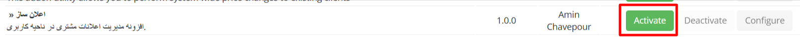
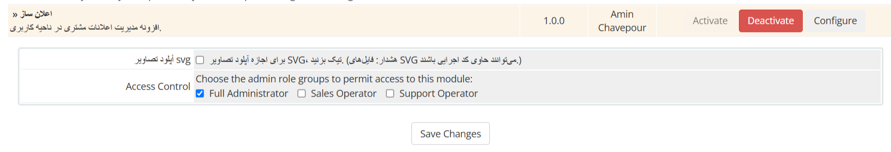
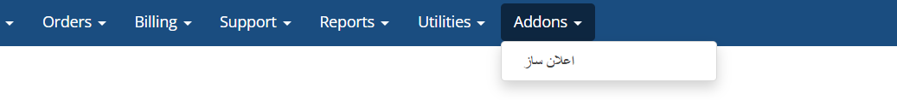
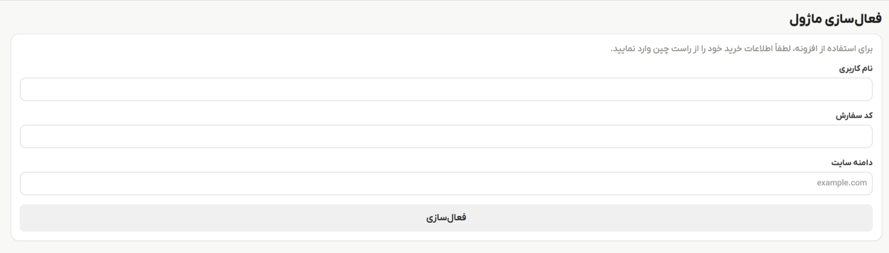

# نصب و فعالسازی

- پس از دانلود فایل افزونه از سایت راست چین، آن را در مسیر اصلی WHMCS خود اکسترکت نمایید.
- وارد صفحه مدیریت WHMCS خود شوید و از بخش افزونه ها افزونه اعلان ساز را فعال نمایید.
  

- سپس از بخش پیکربندی گزینه Full Administrator یا همان مدیر کامل را فعال و ذخیره کنید.
  
  - بدلیل دلایل امنیتی آپلود تصاویر svg در افزونه غیرفعال میباشد. برای دسترسی آپلود svg تیک `آپلود تصاویر svg` را فعال کنید

- پس از نصب و فعالسازی افزونه در منوی افزونه ها روی افزونه اعلان ساز کلیک کنید.
  
- در صفحه باز شده نام کاربری، کد لایسنس و دامنه خود را در فیلدهای مربوط وارد و فعال کنید.
  
