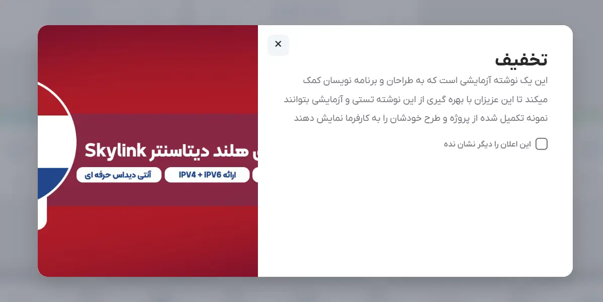

import Tabs from "@theme/Tabs";
import TabItem from "@theme/TabItem";

# استایل ها


تب استایل ها به عنوان یک کتابخانه طراحی متمرکز برای ماژول عمل میکند. به جای پیکربندی دستی رنگ‌ها، طرح‌بندی و CSS برای هر اعلان که ایجاد میکنید، میتوانید یک **استایل** قابل استفاده مجدد در اینجا ایجاد کنید و بعداً آن را در اعلان های خود اعمال کنید.

وقتی به یک اعلان یک استایل خاص اختصاص داده میشود، تنظیمات اعلان (مانند انیمیشن، رنگ و اندازه) کلا توسط تنظیمات استایل نادیده گرفته میشود.

### اطلاعات پایه

این فیلدها به شما کمک میکنند تا استایل را شناسایی و مدیریت کنید.

- **فعال:** سوئیچ اصلی برای استایل. اگر این تیک را بردارید، استایل دیگر هنگام ایجاد یک اعلان جدید در [منوی کشویی استایل اعلان](/elansaz-whmcs-module/configuration#%D8%A7%D8%B3%D8%AA%D8%A7%DB%8C%D9%84-%D8%A7%D8%B9%D9%84%D8%A7%D9%86) ظاهر نمیشود.
- **نام استایل:** نام استایل (مثلاً **بنر فروش نوروز** یا **هشدار**).
- **نامک:** یک شناسه سازگار با آدرس که در صورت خالی بودن به طور خودکار از نام تولید میشود (مثلاً، **black-friday-banner**).
- **توضیحات:** یادداشت‌ یا توضیحات اختیاری که توضیح میدهند این سبک باید برای چه مواردی استفاده شود.

### تصاویر و جایگاه‌

این تنظیمات نحوه نمایش و عملکرد اعلان را روی صفحه تعیین میکنند.

- **حالت نمایش:** جایی که اعلان ظاهر میشود. گزینه‌ها شامل مودال‌های وسط‌چین و... هستند که در بخش [تنظیمات اعلان](/elansaz-whmcs-module/configuration#%D8%A7%D8%B3%D8%AA%D8%A7%DB%8C%D9%84-%D8%A7%D8%B9%D9%84%D8%A7%D9%86) توضیح داده شده است.
- **تم رنگی و رنگ اعلان:** پالت رنگ و کد رنگ مخصوص که دکمه‌ها، هایلایت‌ها و نوار بالایی را رنگ‌آمیزی میکند.
- **عرض و ارتفاع:** انداره اعلان درصد(%) یا پیکسل(px). اگر خالی بماند، ماژول به اندازه خودکار خود متکی است.
- **نوع انیمیشن و مدت زمان انیمیشن:** نحوه ورود اعلان به صفحه و سرعت انیمیشن که بر حسب میلی‌ثانیه اندازه‌گیری میشود.

### تنظیمات پیشرفته

اینجاست که تب استایل فوق‌العاده قدرتمند میشود. این تب به شما امکان میدهد کدهای HTML و CSS اعلان را کاملاً بازنویسی کنید.

- **CSS سفارشی:** به شما امکان میدهد کد CSS را برای این سبک انتخاب شده تزریق کنید.
  - `{root}`: اگر کد CSS استاندارد را اینجا بنویسید، ممکن است به‌طور تصادفی قالب WHMCS شما را خراب کند. برای جلوگیری از این اتفاق، ماژول از یک انتخابگر اختصاصی CSS به نام `{root}` استفاده میکند.\
    نوشتن `{root} .es-panel { border-radius: 4px; }` تضمین میکند که CSS سفارشی شما منحصراً اعلان را هدف قرار میدهد و نه چیز دیگری در صفحه قالب سایت شما.
- **قالب HTML:** به شما امکان میدهد اسکلت HTML پیشفرض ماژول را به طور کامل با اسکلت HTML خودتان جایگزین کنید. شما HTML خام خود را مینویسید و از متغییرها برای تعیین محل تزریق محتوای دیتابیس به ماژول استفاده میکنید.
  - متغییرهای پشتیبانی شده: `{title}`, `{body}`, `{button}`, `{image}`, `{close}`, `{secondary_close}`, `{actions}`, `{auto_close}`, `{permanent_close}`, `{accent}`, `{content}`

### مثال

یک مثال از نحوه استفاده از قالب HTML و CSS سفارشی برای ایجاد طرح‌بندی تقسیم صفحه (تصویر در سمت چپ، متن در سمت راست).

این 2 کد را در فیلد های مربوطه قرار دهید. توجه کنید که چگونه ازمتغییرهای `{}` ماژول برای تزریق محتوا در جایی که میخواهیم، ​​درون تگ‌های `<div>` سفارشی خود استفاده میکنیم. همچنین توجه کنید که در کد CSS از تگ `{root}` استفاده کنید تا استایل‌ها فقط روی اعلان تأثیر بگذارد و به قالب WHMCS شما سرایت نکند.

<Tabs>
    <TabItem value="html" label="قالب HTML">
    ```html 
      <div class="custom-split-layout">
        <div class="custom-text-column">
          {close}
          <div class="custom-inner-content">
            {title} {body} {actions} {auto_close} {permanent_close}
          </div>
        </div>
        <div class="custom-image-column">{image}</div>
      </div>
    ```
    </TabItem>
    
    <TabItem value="css" label="CSS سفارشی">
    ```css
      {root} .es-panel {
          padding: 0;
          max-width: 850px;
          border-radius: 16px;
          overflow: hidden;
      }

      {root} .custom-split-layout {
          display: flex;
          flex-direction: row;
          min-height: 400px;
          background: #ffffff;
      }
      {root} .custom-image-column {
          flex: 1;
          background: #f8fafc;
          position: relative;
      }
      {root} .custom-image-column .es-image-main {
          height: 100%;
      }
      {root} .custom-image-column img {
          width: 100%;
          height: 100%;
          object-fit: cover;
          position: absolute;
          top: 0;
          left: 0;
      }
      {root} .custom-text-column {
          flex: 1.2;
          padding: 40px;
          display: flex;
          flex-direction: column;
          justify-content: flex-start;
          position: relative;
      }

      {root} .es-close {
          top: 15px;
          left: 15px;
          background: #f1f5f9;
      }
    ```
    </TabItem>

</Tabs>



#### چگونگی کارکرد:

وقتی اعلان از این استایل استفاده میکند، افزونه کد HTML را فراخوانی میکند. متن فارسی یا انگلیسی که ادمین در پنل افزونه وارد کرده است را میگیرد، آن را به HTML تبدیل میکند و آن را با `{title}` و `{body}` جایگزین میکند. سپس تصویر آپلود شده را میگیرد و `{image}` را جایگزین میکند.

این به شما آزادی کامل در ظاهر اعلان میدهد. اگر زمانی خواستید طرح‌بندی را تغییر دهید تا تصویر در سمت راست باشد، کافیست `<div class="custom-image-column">` را به زیر ستون متن در قالب HTML منتقل کنید.

### مدیریت استایل ها و استایل های پیشفرض

- **ترتیب مرتب‌سازی:** تعیین میکند که این سبک هنگام ایجاد یک اعلان، در کجای لیست کشویی نمایش داده شود. اعداد کوچکتر در لیست بالاتر نمایش داده میشوند.
- **استایل های پیشفرض:** در لیست استایل‌ها(پایین صفحه)، متوجه خواهید شد که برخی از استایل‌ها با برچسب "استایل پیشفرض" مشخص شده‌اند. این‌ها 6 قالب از پیش تعریف شده هستند که به طور خودکار توسط ماژول پس از فعال‌سازی تزریق میشوند، بنابراین شما یک نقطه شروع دارید.

### لیست استایل ها


در این جدول میتوانید استایل های پیشفرض و شخصی خود را مشاهده، ویرایش یا حذف کنید.
