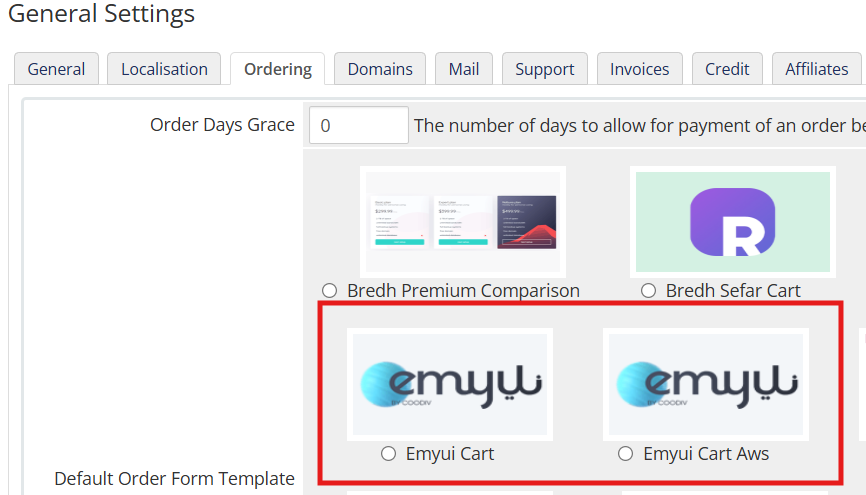

# راهنمای قالب هاستینگ emyui

## نصب

### ساختار فایل زیپ

```bash {4}
help
HTML
WHMCS 9.0.4
└── templates
    ├── emyui
    ├── emyui-aws
    ├── emyui-aws-pro
    ├── emyui-hero
    ├── emyui-mola
    ├── emyui-vpn
    └── orderforms
        ├── emyui_cart
        └── emyui_cart_aws
```

برای نصب قالب پوشه `templates` را در محل نصب whmcs خود آپلود کنید.\
سپس در تنظمات عمومی و قالب و فرم سفارش را تغییر دهید. قالب 6 دمو و 2 دموی فرم سفارش دارد که میتوانید به دلخواه انتخاب کنید:

- دموهای قالب
  - `emyui`
  - `emyui-aws`
  - `emyui-aws-pro`
  - `emyui-hero`
  - `emyui-mola`
  - `emyui-vpn`

- دموهای فرم سفارش
  - `emyui_cart`
  - `emyui_cart_aws`




:::rtnote[نکات]

1. برای شخص سازی قالب نیازمند دانش کدنویسی هستید.
2. جهت هرگونه شخصی سازی یا راهنما از طریق [تیکت](https://www.rtl-theme.com/dashboard/#/ticket-send) در راست چین در ارتباط باشید.

:::

## شخصی سازی قالب

### ویرایش محتوای قالب

در دموها بجز دموی `emyui-mola` و `emyui` یک پوشه بنام `theme-parts` وجود دارد که میتوانید محتوای قالب را در آن ویرایش کنید.

```bash
emyui-aws
└── theme-parts
    ├── customers-reviews.tpl # نظر کاربران
    ├── domain-registration.tpl # ثبت دامنه
    ├── hosting-plans.tpl # تعرفه ها
    ├── how-works-section.tpl
    └── vps-plans.tpl
```

### ویرایش نوشته ها

در بعضی از فایل ها نوشته ها به صورت `{$LANG.xxx.xxx}` است. سیستم WHMCS چند زبانه است و برای نمایش قالب به زبان مورد نظر هنگام تغییر آن در صفحه اصلی، whmcs آن را از فایل زبان خود میگیرد.\
فایل های زبان در مسیر `[whmcs_root]/langs` قرار دارند. با ویرایش این فایل ها، بعد از آپدیت whmcs همه ویرایشات به نسخه اولیه خود برمیگردند. برای ویرایش فایل های زبان مراحل زیر را دنبال کنید:

1. یک پوشه به نام `overrides` در همان مسیر `[whmcs_root]/langs` ایجاد کنید
2. فایل هر زبانی را که میخواهید ویرایش کنید را در این پوشه قرار دهید.
3. فایل را باز کنید و همه رشته های موجود از خط `if (!defined("WHMCS")) die("This file cannot be accessed directly");` به پایین را پاک کنید. (این کار ضروری نیست و فقط برای دسترسی آسان به رشته ها است)
4. برای ویرایش رشته های پیشفرض، کلمه مورد نظر را در فایل جستجو و ویرایش کنید.\
   مثال:

   ```php {24}
   <?php
    /**
     * WHMCS Language File
    * Persian (fa_IR)
    *
    * Please Note: These language files are overwritten during software updates
    * and therefore editing of these files directly is not advised. Instead we
    * recommend that you use overrides to customise the text displayed in a way
    * which will be safely preserved through the upgrade process.
    *
    * For instructions on overrides, please visit:
    *   https://developers.whmcs.com/languages/overrides/
    *
    * @package    WHMCS
    * @author     WHMCS Limited <development@whmcs.com>
    * @copyright  Copyright (c) WHMCS Limited 2005-2026
    * @license    https://www.whmcs.com/license/ WHMCS Eula
    * @version    $Id$
    * @link       https://www.whmcs.com/
    */

    if (!defined("WHMCS")) die("This file cannot be accessed directly");

    $_LANG['account'] = "داشبورد";
    ?>
   ```

   همچنین برای ایجاد یک رشته جدید یکی از رشته هارا برای نمونه کپی و آن را تغییر دهید.\
    مثال:

   ```php {24}
   <?php
    /**
     * WHMCS Language File
    * Persian (fa_IR)
    *
    * Please Note: These language files are overwritten during software updates
    * and therefore editing of these files directly is not advised. Instead we
    * recommend that you use overrides to customise the text displayed in a way
    * which will be safely preserved through the upgrade process.
    *
    * For instructions on overrides, please visit:
    *   https://developers.whmcs.com/languages/overrides/
    *
    * @package    WHMCS
    * @author     WHMCS Limited <development@whmcs.com>
    * @copyright  Copyright (c) WHMCS Limited 2005-2026
    * @license    https://www.whmcs.com/license/ WHMCS Eula
    * @version    $Id$
    * @link       https://www.whmcs.com/
    */

    if (!defined("WHMCS")) die("This file cannot be accessed directly");

    $_LANG['chap'] = "چاپ";
   ```

   سپس در قالب به این صورت میتوانید از آن استفاده کنید:

   ```html
   <div class="title">{lang key='chap'}</div>
   ```
