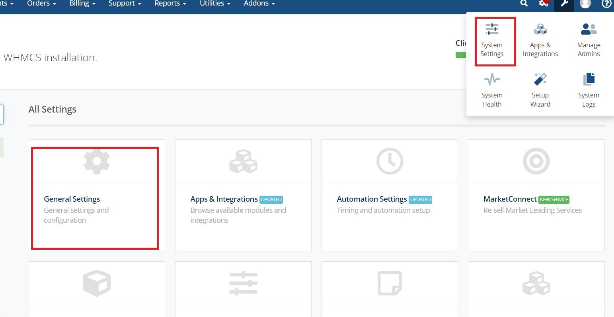
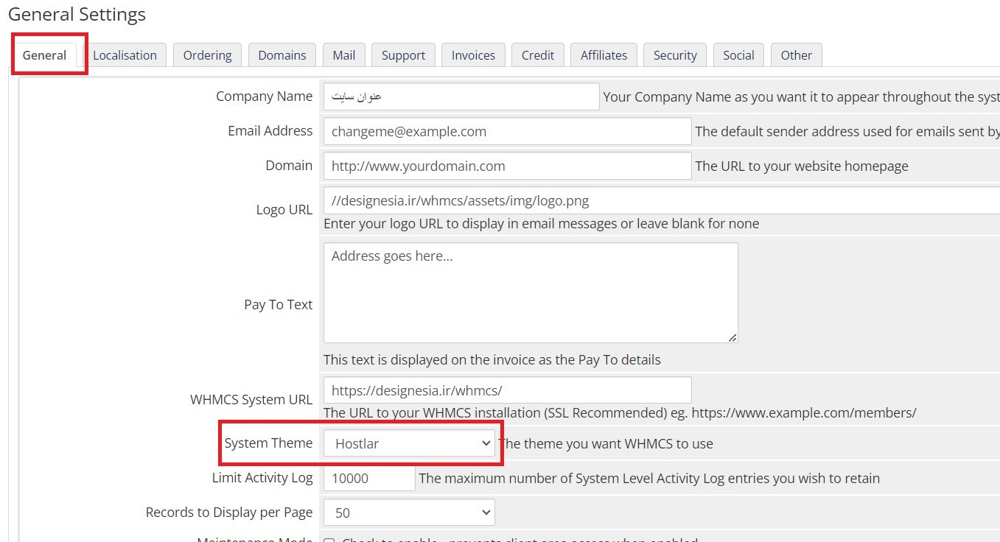
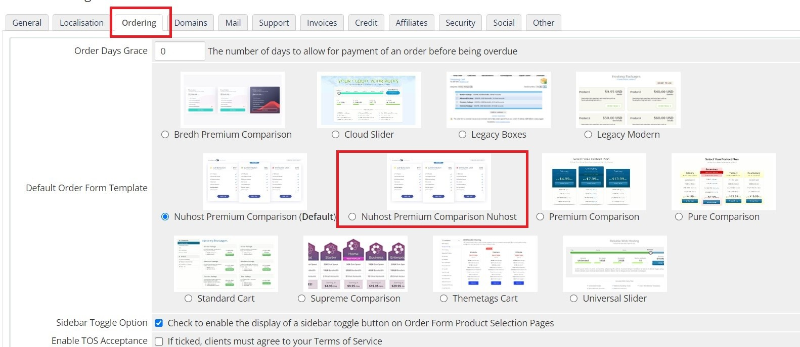
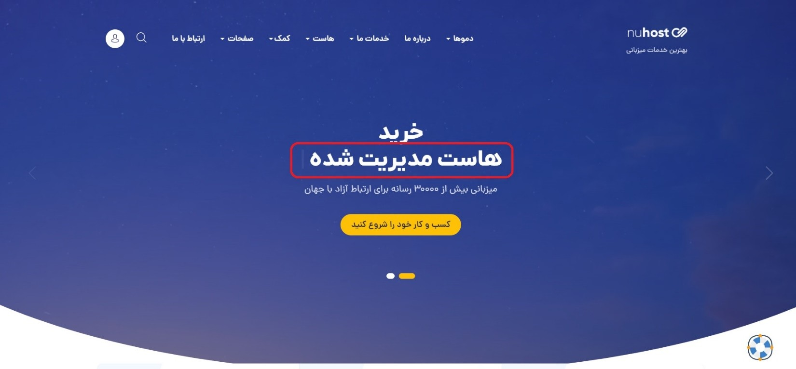

import Tabs from "@theme/Tabs";
import TabItem from "@theme/TabItem";

# راهنمای قالب هاستینگ نوهاست

## ساختار فایل زیپ

```bash {4,6}
help
└── help.pdf
nuhost
├── HTML
└── WHMCS 9.0.4
    └── templates
        ├── nuhost
        └── orderforms
```

## نصب نسخه HTML

برای نصب این نسخه از قالب کافی است محتویات پوشه `HTML` را در هاست خود آپلود کنید.

## نصب نسخه WHMCS

برای نصب نسخه whmcs پوشه `templates` را در محل نصب whmcs خود آپلود کنید.\
سپس در تنظمات عمومی و قالب و فرم سفارش را تغییر دهید. قالب 2 دمو دارد که میتوانید به دلخواه انتخاب کنید:





:::rtnote[نکات]

1. برای شخص سازی قالب نیازمند دانش کدنویسی هستید.
2. جهت هرگونه شخصی سازی یا راهنما از طریق [تیکت](https://www.rtl-theme.com/dashboard/#/ticket-send) در راست چین در ارتباط باشید.

:::

## شخصی سازی قالب

### پیگیربندی لوگو

این قالب به دو لوگو نیاز دارد، یکی برای پس زمینه سفید و دیگری برای پس زمینه تیره.\
لوگوهای خود را در پوشه `img/header` با فرمت `png` و بدون پس زمینه قرار دهید.
`logo.png` برای پس‌زمینه‌های تیره، `logo-b.png` برای پس‌زمینه‌های سفید.

### تغییر متن تایپ شونده در هدر


برای تغییر متن در نسخه `HTML` فایل `script.js` را در پوشه `js` باز کنید و در خط `169` کلمات را تغییر دهید.\
و برای تغییر در نسخه `WHMCS` فایل `nuhost-scripts.js` را در پوشه `js` باز کنید و در خط `191` کلمات را تغییر دهید.

<Tabs>
    <TabItem value="js" label="HTML">
    ```js  showLineNumbers=167 title="/js/script.js" {3}
    $(function(){
        $("#typed").typed({
            strings: ["سرور اختصاصی ", "سرور مجازی ","هاست ", "هاست مدیریت شده "],
            typeSpeed: 90,
            loop:true,
        });
    });
    ```
    </TabItem>
    
    <TabItem value="py" label="WHMCS">
    ```js  showLineNumbers=189 title="/nuhost/js/nuhost-scripts.js" {3}
    $(function(){
        $("#typed-fa").typed({
            strings: ["هاست دانلود ", "هاست مدیریت شده ","سرور مجازی ", "هاست "],
            typeSpeed: 90,
            loop:true,
        });
	});
    ```
    </TabItem>

</Tabs>

### پس زمینه های رنگی هدر

قالب دارای 6 گرادینت برای پس زمینه هدر است که می توانید یکی از آنها را انتخاب کنید

```css title="/css/main.css"
.grandient-blue-text-color {
  background: -webkit-linear-gradient(to bottom, #6a82fb, #4558b7);
  background: linear-gradient(to bottom, #6a82fb, #4558b7);
}
.grandient-red-text-color {
  background: -webkit-linear-gradient(to bottom, #ff5f6d, #ff5fc9);
  background: linear-gradient(to bottom, #ff5f6d, #ff5fc9);
}
.grandient-green-text-color {
  background: -webkit-linear-gradient(to bottom, #8cc34c, #4cc390);
  background: linear-gradient(to bottom, #8cc34c, #4cc390);
}
.grandient-yellow-text-color {
  background: -webkit-linear-gradient(to bottom, #f8aa22, #e5f822);
  background: linear-gradient(to bottom, #f8aa22, #e5f822);
}
.grandient-blue-t-text-color {
  background: -webkit-linear-gradient(to bottom, #1cbfd2, #1c92d2);
  background: linear-gradient(to bottom, #1cbfd2, #1c92d2);
}
.grandient-blue-th-text-color {
  background: -webkit-linear-gradient(to bottom, #41a4f7, #416bf7);
  background: linear-gradient(to bottom, #41a4f7, #416bf7);
}
```

برای استفاده از یکی از آنها فقط کلاس گرادینت را کپی کرده و:\
در نسخه HTML آن را در فایل `index.html` و خط `88` قرار دهید\
در نسخه WHMCS آن را در فایل `header.tpl` و خط `47` قرار دهید\
نکته: برای نمایش گرادینت باید پس زمینه ویدیو حذف شود که در بخش بعدی توضیح داده شده است

<Tabs>
    <TabItem value="js" label="HTML">
    ```html title="index.html" 
    
    <div id="header" class="homepagetwostyle d-flex mx-auto flex-column your-gradient-class [your-gradient-class]">

    ```
    </TabItem>

    <TabItem value="py" label="WHMCS">
    ```html title="header.tpl"

    <div id="header"  class="{if $templatefile == 'homepage'}{else}whmcs-not-index-template{/if} [your-gradient-class]">

    ```
    </TabItem>

</Tabs>

### پس زمینه ویدیو هدر

برای حذف ویدیو فایل صفحه مورد نظر را باز کنید و:\
در نسخه HTML فایل `index.html` را باز کرده و خط `108` تا `114` را حذف کنید\
در نسخه WHMCS فایل `header.tpl` را باز و خط `67` تا `73` را حذف کنید

<Tabs>
    <TabItem value="js" label="HTML">
    ```html title="index.html" showLineNumbers=108
        <!-- start video background -->
        <div class="video-bg-nuhost-header">
            <div id="video_cover"></div>
            <video autoplay muted loop><source src="media/coodiv-vid.mp4" type="video/mp4"></video>
            <span class="video-bg-nuhost-header-bg"></span>
        </div>
        <!-- end video background -->
    ```
    </TabItem>

    <TabItem value="py" label="WHMCS">
    ```html title="header.tpl" showLineNumbers=67
    <!-- start video background -->
    <div class="video-bg-nuhost-header">
        <div id="video_cover"></div>
        <video autoplay muted loop><source src="{$WEB_ROOT}/templates/{$template}/media/coodiv-vid.mp4" type="video/mp4"></video>
        <span class="video-bg-nuhost-header-bg"></span>
    </div>
    <!-- end video background -->
    ```
    </TabItem>

</Tabs>

### افزودن مکان به نقشه

دو نقشه ایران و جهان در قالب وجود دارد که میتوانید با توجه به نیاز خود از آن استفاده کنید.\
برای تغییر نقشه:\
در نسخه html فایل `index.html` را باز و در خط `1158` مقدار `src` را به مسیر تصویر نقشه تغییر دهید

```html
<!-- map -->
```

برای افزودن مکان به نقشه یک تگ `span` مانند زیر، پایین تگ عکس نقشه اضافه کنید و مقادیر را تغییر دهید:\

- نام مکان :`title`
- مختصات عرضی :`top`
- مختصات طولی :`left`

{/* prettier-ignore */}
```html
<span data-toggle="tooltip" data-placement="top" title="یزد" style="top: 55%;left: 47%;" class="place"></span>
```

### ویرایش نوشته ها

در بعضی از فایل ها نوشته ها به صورت `{$LANG.xxx.xxx}` است. سیستم WHMCS چند زبانه است و برای نمایش قالب به زبان مورد نظر هنگام تغییر آن در صفحه اصلی، whmcs آن را از فایل زبان خود میگیرد.\
فایل های زبان در مسیر `[whmcs_root]/langs` قرار دارند. با ویرایش این فایل ها، بعد از آپدیت whmcs همه ویرایشات به نسخه اولیه خود برمیگردند. برای ویرایش فایل های زبان مراحل زیر را دنبال کنید:

1. یک پوشه به نام `overrides` در همان مسیر `[whmcs_root]/langs` ایجاد کنید
2. فایل هر زبانی را که میخواهید ویرایش کنید را در این پوشه قرار دهید.
3. فایل را باز کنید و همه رشته های موجود از خط `if (!defined("WHMCS")) die("This file cannot be accessed directly");` به پایین را پاک کنید. (این کار ضروری نیست و فقط برای دسترسی آسان به رشته ها است)
4. برای ویرایش رشته های پیشفرض، کلمه مورد نظر را در فایل جستجو و ویرایش کنید.\
   مثال: `$_LANG['account'] = "حساب";` --> `$_LANG['account'] = "داشبورد";`\
    همچنین برای ایجاد یک رشته جدید یکی از رشته هارا برای نمونه کپی و آن را تغییر دهید.\
    مثال: `$_LANG['print'] = "پرینت";` --> `$_LANG['chap'] = "چاپ";`\
    سپس در قالب به این صورت میتوانید از آن استفاده کنید: `{$LANG.chap}`
