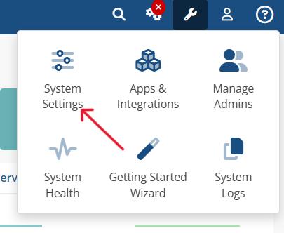
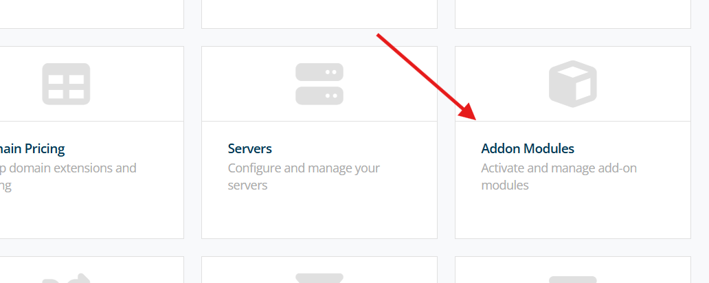
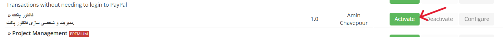
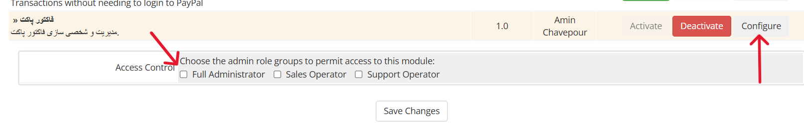
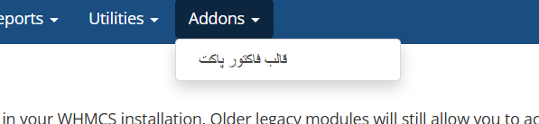
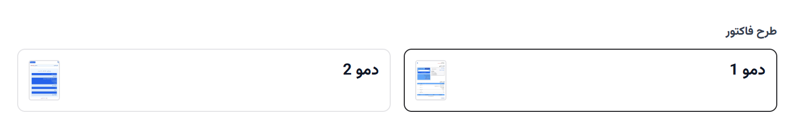
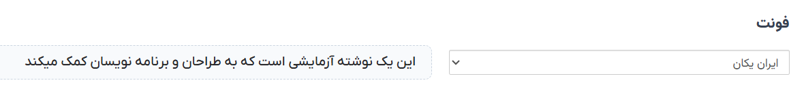
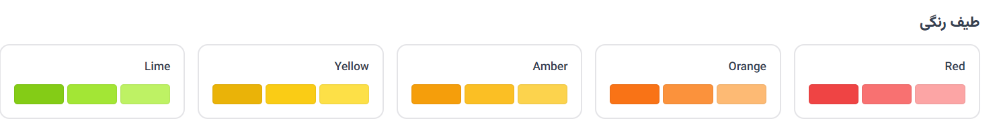
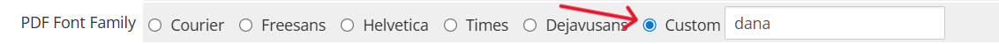

# راهنما

با تشکر از شما برای خرید قالب.

## نصب

پکیج را از راست چین دانلود کرده و باز کنید. 3 پوشه و 1 فایل داخل آن قرار دارد: `modules` `pocketinvoice` `vendor` `invoicepdf.tpl`

- پوشه `modules` و `vendor` را در محصل نصب whmcs اکسترکت کنید.
- پوشه `pocketinvoice` و فایل `invoicepdf.tpl` را در محصل نصب قالب خود اکسترکت کنید:

`public_html/templates/template_name`

بعد از آپلود قالب وارد ناحیه ادمین خود شوید. به مسیر `System Setting/Addon Modules` بروید

ماژول قالب را فعال و دسترسی لازم را به آن دهید

در منوی بالا وارد پنل ماژول شوید\

## شخصی سازی قالب فاکتور

در سیستم whmcs دو نوع فاکتور وجود دارد. آنلاین و pdf. در قالب 2 دموی آنلاین و یک دموی pdf موجود است که در نسخه های بعد دموهای بیشتری اضافه میشود.

در بخش طرح فاکتور میتوانید دموی مورد نظر را انتخاب کنید و با کلیک روی تصویر بندانگشتی سمت چپ میتوانید پیشنمایش آن را مشاهده کنید.

در بخش فونت میتونید فونت قالب را انتخاب کنید و در سمت چپ آن پیشنمایش فونت مشاهده میشود.

در بخش رنگ میتوانید طیف رنگی قالب را انتخاب کنید. 24 طیف رنگی موجود است.

## تغییر فونت قالب فاکتور pdf

امکان تغییر فونت در نسخه pdf داخل پنل قالب وجود ندارد و باید آن را در تنطیمات whmcs انجام داد

وارد تنظیمات عمومی whmcs شوید `System Setting/General Settings/Invoices/PDF Font Family` گزینه custom را فعال کنید و نام فونت را وارد کنید.

در قالب 4 فونت موجود است نام یکی از آنها را به دلخواه وارد کنید

- `dana`: دانا
- `iranyekanxfanum`: ایران یکان
- `iransansxfanum`: ایران سنس
- `yekanbakhfanum`: یکان بخ

جهت هر گونه مشکل، انتقاد، پیشنهاد، شخصی سازی قالب و اضافه کردن فونت و رنگ جدید از طریق [تیکت](https://www.rtl-theme.com/dashboard/#/ticket-send) در ارتباط باشید.\

#### جهت حمایت از قالب در پنل کاربری خود به آن امتیاز دهید👍
